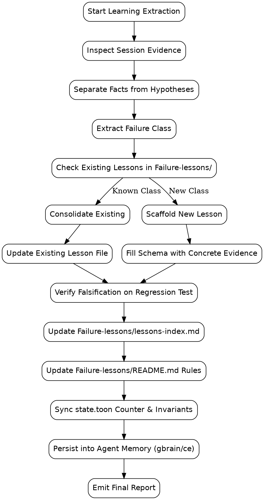

# PyMC Durable Learnings Skill

## Overview

Convert engineering sessions, bugfixes, architectural discoveries, and operational failures within the **PyMC Marketing MCP** and **Unified PyMC Marketing Platform** into permanent, reusable repository knowledge.

> **Core Axiom**: Pay for an engineering mistake once. After that, the repository should remember it.

Do not write a simple session summary or narrative changelog. Extract the root failure mechanism, codify a binding prevention invariant, link it to real code and verified regression tests, and update the repository's single-source-of-truth ledgers.

---

## When to Use

### Triggers & Symptoms
- After resolving an unexpected bug, test failure, runtime crash, or statistical discrepancy in the PyMC platform.
- When fixing multi-tenant isolation, cross-tenant leaks, or repository scoping issues (`organization_id`).
- When diagnosing MCMC sampler failures, convergence divergence, or diagnostic gate rejections (`max_rhat`, `divergences`, `min_bfmi`).
- When encountering contract drift between Python Pydantic models, JSON Schemas, Rust Serde types, or TypeScript client types.
- When resolving async worker lifecycle bugs, cancelled job leaks, or artifact readiness race conditions.
- When discovering container, dynamic linking (PyO3), or packaging incompatibilities.
- When completing a milestone or PR where a non-obvious architecture pattern was established.

### When NOT to Use
- Routine, non-failing task completions (e.g. updating a version number, bumping a minor doc typo).
- Unfinished debugging sessions where root causes and symptoms are completely unknown.
- Speculative architectural ideas that have no implementation or verification in the repository.

---

## Execution Workflow



---

## Execution Phases

### Phase 1: Tool Selection & Environment Inspection

Inspect available learning and memory tools in the current environment:
1. **`Failure-lessons/`**: Canonical repository knowledge base (Lessons 01..64+).
2. **`state.toon`**: TOON v4.1 platform state ledger (`failure_lessons_count`, `operating_invariants`).
3. **`scripts/scaffold_lesson.py`**: Automated lesson file generator and indexer.
4. **`gbrain` MCP Tool**: Long-term memory graph (`remember`, `extract_facts`, `entity`, `synthesize`).
5. **`ce-compound`**: Compound Engineering solutions directory (`docs/solutions/`).
6. **`gsd:extract-learnings`**: GSD phase learning extractor (if active in `.planning/`).

*Rule*: Use whatever memory tools are actually registered in the runtime. Never simulate or pretend a tool ran if it was not executed.

---

### Phase 2: Session Reconstruction & Evidence Extraction

Review the session trajectory before writing anything:
- Git diff: `git diff HEAD~1` or `git status` to see exact modified lines.
- Test logs: Check which tests failed initially and what traceback was raised.
- Tool calls: Identify where assumptions broke (e.g. missing validation, type error, timeout).
- Reviewer feedback: Identify issues flagged during code review or pre-push gates.
- Do NOT sanitize history: A failed approach or flawed initial patch often holds the most valuable lesson.

---

### Phase 3: Facts vs Hypotheses Classification

For every finding, assign an explicit confidence classification:
- **Confirmed**: Root cause demonstrated by a reproducing test and code trace.
- **Strongly indicated**: High probability based on logs/traces, but not isolated deterministically.
- **Open hypothesis**: Plausible explanation without experimental verification.
- **Unknown**: Anomaly observed without verified mechanism.

*Never present an open hypothesis as confirmed fact.*

---

### Phase 4: Failure Class Abstraction

Organize lessons by **system failure class**, never by ticket number or commit hash:
- ❌ *Bad*: "Bug #142", "Issue from Wednesday", "PR #35 fix".
- ✅ *Good*: "Unvalidated Financial Assumptions in Decision Builders", "Atomic Operation Admission and Canonical Scoping", "Deceptive Cancellation and Orphan Compute Fence".

Ask the deeper architectural questions:
- Why was this error possible in the first place?
- Was validation duplicated across entry points?
- Did caller and server disagree on API semantics?
- Was an asynchronous transition assumed to be instantaneous?

---

### Phase 5: Knowledge Base Authoring & Scaffolding

Use the automated scaffolder script to create the new lesson:

```bash
python3 .agents/skills/pymc-durable-learnings/scripts/scaffold_lesson.py \
    --slug "<kebab-case-slug>" \
    --title "<Descriptive Title>" \
    --failure-class "<Category / System Area>" \
    --rule "<Binding Invariant Rule>" \
    --status "Resolved"
```

The script will:
1. Determine the next sequential lesson number (e.g. `65`).
2. Generate `Failure-lessons/<NN>-<slug>.md` with the full canonical schema.
3. Automatically append the entry to `Failure-lessons/lessons-index.md`.
4. Update `failure_lessons_count` in `state.toon`.

Complete the generated markdown file by editing `Failure-lessons/<NN>-<slug>.md`:
- Follow [failure-lesson-schema.md](./references/failure-lesson-schema.md).
- Populate all sections: Context, What happened, Impact, Observable symptom, Incorrect assumption, Root cause, Why the system allowed it, Fix, Verification, Prevention rule, Reusable lesson, Related code, Related tests, Related lessons, Status.

---

### Phase 6: Indexing & "Rules We Now Enforce"

1. **Verify Index**: Confirm `Failure-lessons/lessons-index.md` has the new row formatted correctly:
   ```markdown
   | Lesson <NN> | <Failure Class> | <Prevention Rule> | [<NN>-<slug>.md](./<NN>-<slug>.md) |
   ```
2. **Update Platform Invariants in `Failure-lessons/README.md`**:
   - If the lesson introduces a platform-wide rule, add it to the numbered list under `## Rules We Now Enforce` (e.g. Rule 34).
   - Keep the rule concise, binding, and active-voice.
3. **Thematic Guides (if applicable)**:
   - If the lesson belongs to an existing topic, update the relevant guide in `Failure-lessons/`:
     - `decision-integrity.md` (optimizer, scale invariance, budget)
     - `model-lineage.md` (cohorts, multi-model composition, hashes)
     - `artifact-lifecycle.md` (readiness races, atomic writes, immutability)
     - `job-lifecycle.md` (async states, cancellation fences, recovery)
     - `validation-contracts.md` (preflight vs worker validation parity)
     - `api-contracts.md` (error taxonomy, traceback sanitization)
     - `testing-and-verification.md` (adversarial testing, flakiness calibration)

---

### Phase 7: Code & Regression Test Grounding (Falsification Protocol)

1. **Verify Code References**:
   Ensure all referenced files exist in the repository (e.g. `apps/gateway/src/...`, `packages/contracts/...`, `pymc-marketing-mcp/src/...`).
2. **Adversarial Falsification Test**:
   - Every high-impact failure must have a corresponding regression test.
   - Prove the test is real: temporarily revert or comment out the fix in a local check, run the test, and confirm it fails (RED).
   - Restore the fix and confirm it passes (GREEN).
   - *If the test passes even with the fix removed, the test is decorative and does not protect against the failure.*

---

### Phase 8: `state.toon` Platform State Synchronization

Update `state.toon` at the repository root:
1. Verify `failure_lessons_count: <NN>` matches the new total.
2. If a core architectural rule was formed, add it to `operating_invariants` in `state.toon`.
3. Under `session_handoff`, ensure `failure_lessons_count: <NN>` is updated.

---

### Phase 9: Agent Memory & Cross-Tool Sync

Persist distilled lessons to agent memory systems:
1. **`gbrain`**:
   - Call `call_mcp_tool` -> ServerName: `gbrain`, ToolName: `remember`:
     `{"text": "PyMC Invariant [LESSON-NAME]: [PREVENTION RULE]. Verified in [TEST_PATH]."}`
   - Call `extract_facts` with the root cause and architectural invariant.
   - Call `add_timeline_entry` with a brief summary of the lesson learned.
2. **`ce-compound`**:
   - If working within a Compound Engineering workflow, optionally generate a solution doc in `docs/solutions/<category>/<slug>.md`.

---

### Phase 10: Commit Discipline & Final Report

1. **Commit**:
   Commit documentation changes separately from implementation code:
   ```bash
   git add Failure-lessons/ state.toon
   git commit -m "docs(lessons): codify Lesson <NN> - <Title>"
   ```
2. **Final Report Format**:
   Deliver a structured report with these sections:
   - **Learning tools used**: List tools executed (`scaffold_lesson.py`, `gbrain`, `state.toon`, etc.).
   - **Files created**: New lesson file path.
   - **Files updated**: `lessons-index.md`, `README.md`, `state.toon`.
   - **Core lessons extracted**: 2-3 sentence summary of the key lesson.
   - **Rules we now enforce**: The new binding invariant text.
   - **Failure-to-test mappings**: `Failure Class -> Regression Test -> Invariant`.
   - **Unresolved knowledge**: Any remaining hypotheses or unverified edge cases.
   - **Repository changes**: Git commit hash if committed.

---

## Anti-Patterns & Rationalization Table

| Rationalization | Reality | Stop & Fix |
|---|---|---|
| "The bug was simple, no need for a lesson" | Simple bugs repeat across contributors. If it took debugging time, it earned a lesson. | Extract the failure class and write the invariant. |
| "A session summary in chat is sufficient" | Chat transcripts are ephemeral and vanish when context resets. | Write durable markdown into `Failure-lessons/`. |
| "I'll file ticket #123 as the title" | Ticket numbers lose meaning over time. | Title by failure mechanism and architectural condition. |
| "The regression test passed, so we're good" | Passing tests might never execute the broken branch. | Run falsification: revert fix, verify test fails. |
| "I'll dump raw logs and stack traces into the doc" | Log dumps create token bloat and lack insight. | Distill the root cause into facts, mechanisms, and rules. |
| "The hypothesis seems right, I'll label it confirmed" | Unverified assumptions become dangerous dogma. | Label explicitly as 'Open hypothesis' or 'Strongly indicated'. |

---

## Quick Reference Commands

```bash
# Dry run lesson creation
python3 .agents/skills/pymc-durable-learnings/scripts/scaffold_lesson.py \
    --slug "sample-slug" --title "Sample Title" --failure-class "Contracts" --rule "Always validate" --dry-run

# Full platform check
./check.sh

# Run specific Python test suite
PYTHONPATH=. .venv/bin/pytest tests/security/ -v
PYTHONPATH=pymc-marketing-mcp/src:. .venv/bin/pytest pymc-marketing-mcp/tests/contract/ -v
cargo test --workspace
```
