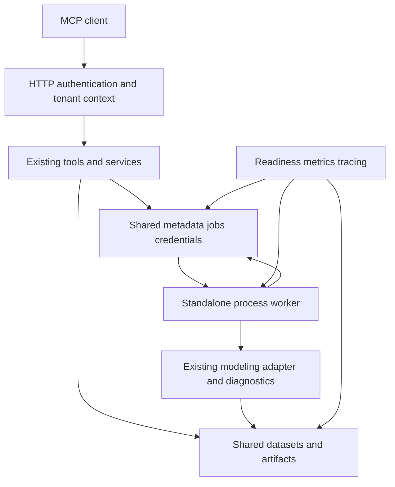
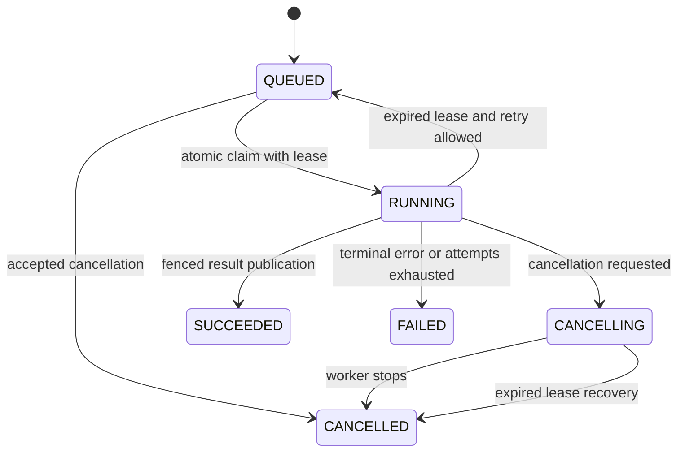
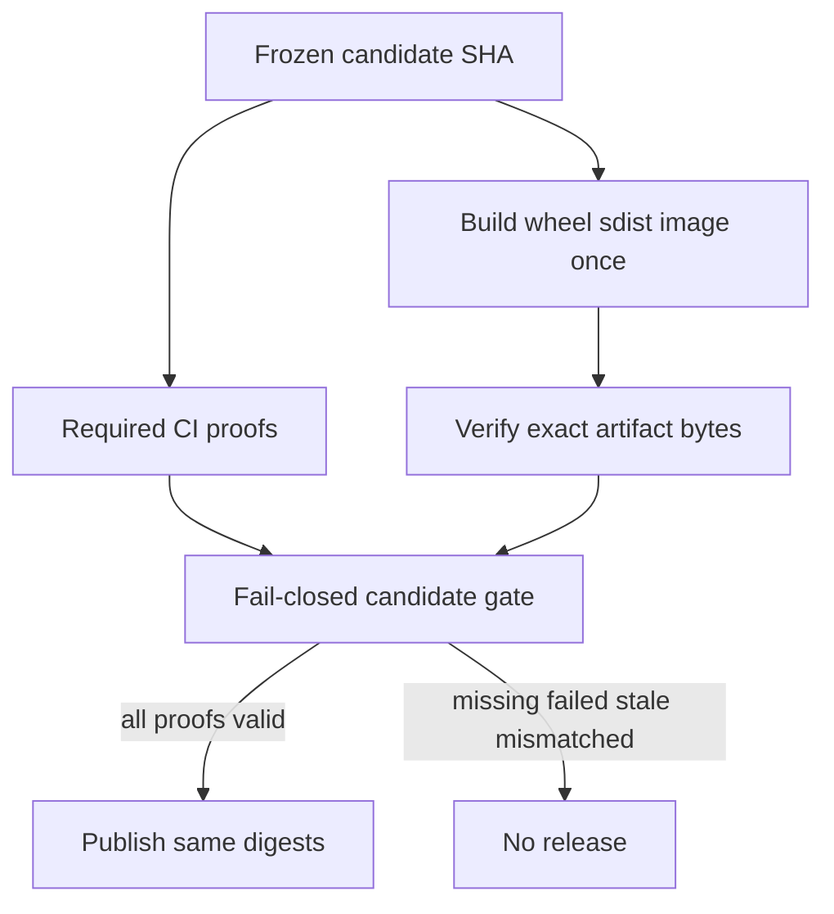

# Production Readiness - Plan

## Goal Capsule

**Objective:** Operators can deploy a secure multi-user marketing MCP service whose scientific decisions, durable work, recovery and published artifacts are independently verifiable.

**Scope decision:** The user chose the full production roadmap over a single-host-only release. Single-host worker validation is an intermediate proof, not the final production claim.

**Readiness:** This roadmap contains detailed work packets, but launch-blocking deployment decisions remain in U1. Metadata stays `requirements-only` until those decisions are recorded and affected contracts are finalized. Independent repository repairs U2–U9 can be authorized separately; this document is not blanket deployment permission.

**Authority:** Confirmed scope and requirements govern behavior; technical decisions govern mechanisms within those constraints; unit tests and fresh CI evidence govern completion. Historical checkmarks and issue closure alone do not authorize release.

**Execution:** Small issue-linked PRs, regression-first fixes, one owner per shared file, and independent review. Stop on conflicting requirements, unsafe migration, failed integrity checks or two consecutive unexplained failures. Diagnose before another speculative edit.

**Release ownership:** A named release owner approves the final candidate; an infrastructure owner accepts recovery objectives; a security reviewer accepts identity and tenancy boundaries. Names are assigned in U1.

---

## Product Contract

### Summary

Harden the existing application rather than replace it. Close all fourteen open issues with reproducible evidence, integrate shared production infrastructure, and prove the full authenticated submit-to-result-to-restore lifecycle before release.

### Problem Frame

At audited HEAD `0f447e5fcc3810c9ccf176ea89f8305dece0243c`, all issues #4–#17 remain open. Existing code has useful service boundaries, request identity, SQLite repositories, diagnostics policy and release tests, but several production paths are disconnected.

Release evidence can mark an empty command set green. Release packaging rebuilds after smoke tests. Statistical matrix lanes repeat the full suite. The standalone worker lacks handlers, async fitting drops principal identity, and startup recovery can fail another instance's active jobs. OAuth settings do not reach the active authentication composition path. Dataset and model bytes remain local.

Live GitHub reports `main` unprotected. Protection/ruleset API reads returned HTTP403 requiring a different GitHub plan or repository visibility. No visibility, billing or remote configuration changes are authorized by this plan.

The audit inspected code and issue bodies, not current scientific test outcomes. The old 446-pass claim is historical. The reported optimization exception still needs controlled diagnosis; persistence is not yet proven to be its cause.

### Requirements

**Release trust**

- R1. Every required G0–G5, H0–H6 and AQG gate is authorized only by complete trusted CI proof for the assessed candidate and declared environment. Missing, skipped, stale or mismatched proof blocks release. (#4)
- R2. Evidence and published diagnostics contain only explicitly allowed provenance, never arbitrary process environment or credentials. (#5)
- R3. Product-branch changes require enforced review and stable required checks; profile automation cannot advance that branch. (#8, #11)
- R4. Statistical shards cover the complete required collection exactly once, except an explicit justified duplicate allowlist; a missing or failed shard blocks the aggregate. (#10)
- R5. Supported CI action runtimes preserve checkout, cache, permissions and artifact semantics. (#13)
- R6. Wheel, sdist, container and evidence are bound to one candidate, and published bytes are the exact verified bytes. (#12)

**Scientific correctness**

- R7. Valid lift calibration uses the declared public contract and creates an immutable child requiring fresh diagnostics. (#6)
- R8. Supported optimization conserves the configured budget, respects bounds and behaves consistently across reload; real non-convergence produces a stable failure, not a recommendation. (#7)
- R9. Install metadata and canaries distinguish supported PyMC-Marketing versions from unproven future majors; plotting follows the supported upstream API. (#15)

**Secure durable service**

- R10. Authenticated identity, scopes and tenant ownership survive HTTP, tools, queued work and artifact access. Invalid production authentication configuration refuses startup. (#14, #9)
- R11. A standalone worker executes validated queued work after the submitting API exits, with durable cancellation, bounded recovery and no double publication from competing workers. (#9)
- R12. Production instances share metadata, jobs and credential revocation through one configured SQL backend, with no silent fallback on outage. (#16)
- R13. Production datasets, models and enabled derived artifacts are shared, integrity-checked and restorable with their metadata. (#17 and inspected dataset/CLV/plot gaps)
- R14. Operators can detect dependency/worker failure, correlate requests to jobs, apply resource limits, and restore service within approved recovery objectives. (G2/G4 closure)
- R15. Real MCP agent evaluations and negative safety scenarios prove the advertised capability contract without weakening statistical or authorization policy. (AQG/H5/H6 closure)

### Key Flows

F1. Authenticated HTTP caller registers data, submits MMM work, polls status, diagnoses the persisted model and obtains a permitted decision. Identity and lineage remain consistent throughout. Covers R7–R13 and R15.

F2. A worker dies or loses its lease while work is running. Recovery occurs after lease expiry; a stale attempt cannot overwrite cancellation or publish a second winning result. Covers R11–R14.

F3. An operator restores SQL and artifact backups into an isolated environment, verifies references and checksums, and reloads representative models before traffic resumes. Covers R12–R14.

F4. CI verifies a frozen candidate, builds each artifact once, smoke-tests those artifacts, evaluates mapped gates, and promotes only their recorded digests. Covers R1–R6.

### Scope Boundaries

Retain existing MCP tool names and diagnostics policy unless a documented contract correction requires change. Keep local SQLite/filesystem and stdio profiles usable. Include current public capabilities in the release proof; a capability that cannot use the production backend must be explicitly disabled and documented, never silently advertised as supported.

Out of scope: new analytics features, UI redesign, a new broker framework, simultaneous S3 and GCS implementations, multi-region active-active service, or automated billing/visibility changes.

### Open Decisions

U1 must record a chosen hosting/runtime topology, one object-store provider, OAuth issuer and trusted tenant-claim mapping, GitHub governance remediation, and named operators. These block the corresponding shared-runtime and deployment units, not independent evidence/science fixes.

Proposed defaults requiring owner approval: PostgreSQL for production SQL; one deployment-native object store; asymmetric issuer/JWKS verification; no additional queue broker; single-region deployment with multiple API/worker processes. No provider is silently selected.

Load profile, availability SLO, queue-age target, dataset/model size limits, sampling concurrency, retention, RPO and RTO need numeric values before U16. Calibrate them with an agreed representative workload rather than inventing production capacity from unit-test timings.

---

## Planning Contract

### Key Technical Decisions

- KTD1. Reuse `Application` as composition root, existing services, `DomainError`, `Principal`/execution context and repository contracts. Add only missing backend seams; no application rewrite. Governs R10–R14.
- KTD2. Keep execution profiles explicit: local convenience versus production enqueue-only API plus process workers. Carry trusted persisted identity into the same modeling service and recheck dataset authorization. Governs R10–R12.
- KTD3. Use transactional claims, expiring leases, heartbeat and fencing tokens on durable jobs. Recovery targets expired attempts, not every RUNNING record at API startup. At-least-once computation is acceptable; duplicate committed effects are not. PostgreSQL row-lock queue semantics are a candidate implementation, not a substitute for fencing. Governs R11–R12.
- KTD4. Store immutable artifact references with size/checksum and ownership metadata. Materialize verified temporary local files only when upstream APIs require a Path. Publish metadata after successful immutable upload, with orphan reconciliation for interrupted publication. Dataset bytes are part of this contract. Governs R13.
- KTD5. Build a versioned gate-proof manifest mapping required test identities, results, environment and trusted run/candidate provenance to each gate. Local/legacy evidence can be displayed but cannot authorize production release. Do not rerun suites or rebuild artifacts inside collection. Governs R1/R2/R4/R6.
- KTD6. Separate stable PR checks from the comprehensive candidate-release tier. Final publication is a least-privilege promotion of already verified digests. A narrow informational future-major canary cannot silently waive release requirements. Governs R1/R3/R5/R6/R9.
- KTD7. Diagnose optimizer failure with an identical before/after-reload experiment before choosing a repair. Neither increasing retries nor relaxing diagnostics is an acceptable substitute. Governs R8.
- KTD8. Verify remote OAuth against the MCP protocol version used by the installed SDK, including resource/audience binding and discovery requirements. API keys and local stdio remain separate deliberate profiles. Do not infer tenant identity from untrusted request parameters. Governs R10.

### High-Level Technical Design







### Milestones and Dependencies

```toon
milestones[6]{id,outcome,units,exit}:
  M0,Freeze decisions and baseline,U1,Owner decisions recorded
  M1,Trustworthy branch and evidence,U2 U3 U4 U5 U9 U10,Fail-closed checks and enforced main
  M2,Supported scientific behavior,U6 U7 U8,Real calibration plotting and reload optimization pass
  M3,Secure durable production runtime,U11 U12 U13 U14 U15,Two-instance authenticated lifecycle passes
  M4,Operational recovery proof,U16 U17,Approved SLO restore and agent evidence
  M5,Verified release candidate,U18,Same-SHA same-bytes promotion approved
```

Milestones are exit gates, not a requirement to serialize independent work. U2 and U4 can start together. U6 packaging policy can proceed while U3 evidence changes. U7 and U8 share adapter/service surfaces and must be serialized or integrated by one scientific owner. U5/U9/U10/U18 share workflows and need one CI integrator. U11/U12/U13/U14 touch composition/settings; settle interfaces first and use one integration owner. No parallel mutation of `app.py`, lockfiles, workflow files or planning state.

Before closing an issue, attach exact acceptance runs, candidate SHA, relevant artifact IDs and reviewer result. Do not close an issue because its plan unit exists. Additional inspected gaps are tracked as U15–U17 until the maintainer authorizes new GitHub issues.

---

## Implementation Units

```toon
units[18]{id,title,primary_path,depends_on}:
  U1,Resolve deployment contract,docs/SPEC.md,none
  U2,Minimize evidence environment,src/marketing_mcp/release_evidence.py,none
  U3,Enforce gate-specific proofs,src/marketing_mcp/release_evidence.py,U2
  U4,Isolate profile automation,.github/workflows/profile_summary_cards.yml,none
  U5,Upgrade action runtimes,.github/workflows/,U4
  U6,Bound upstream compatibility,pyproject.toml,none
  U7,Repair calibration mapping,src/marketing_mcp/services/modeling_service.py,U6
  U8,Diagnose and fix reload optimization,src/marketing_mcp/adapters/pymc_marketing.py,U6 U7
  U9,Partition statistics and aggregate,.github/workflows/statistical.yml,U3 U5
  U10,Enforce branch governance,.github/workflows/ci.yml,U1 U4 U5 U9
  U11,Wire production OAuth,src/marketing_mcp/auth.py,U1
  U12,Execute durable worker jobs,src/marketing_mcp/jobs/,U6
  U13,Add shared SQL repositories,src/marketing_mcp/app.py,U1 U12
  U14,Add shared integrity storage,src/marketing_mcp/storage/artifacts.py,U1 U12
  U15,Integrate shared capabilities,src/marketing_mcp/services/dataset_service.py,U11 U13 U14
  U16,Prove operations and restore,src/marketing_mcp/http/health.py,U15
  U17,Prove agent safety,tests/release/,U7 U8 U9 U15
  U18,Bind and rehearse release,.github/workflows/release.yml,U3 U5 U10 U16 U17
```

New test paths below are proposed deliverables, not claims that those files already exist. Each unit inherits the global scope boundary; explicit local exclusions are included for generated orchestration prompts.

### U1. Resolve deployment and operating contract

#### Step 1

**Goal / requirements:** Make R10–R14 executable without hidden provider assumptions. Owner: maintainer and infrastructure/security leads. Dependencies: none.

**Files:** Update `docs/SPEC.md`; proposed `docs/operations/production-profile.md`.

**Approach:** Record topology/provider decisions and numeric operating targets listed under Open Decisions. Select a GitHub plan/admin remediation without changing repository visibility automatically. Inventory all enabled capability storage and identity requirements. Capture current HEAD, CI status and repeatable workload before repairs.

**Test scenarios:** Confirm every enabled public capability has a persistence/auth path; reject an infrastructure work card with no approved provider/identity contract; obtain owner approval for RPO/RTO and maintenance window.

**Verification:** Decision document names chosen SQL/object/issuer configuration, workload limits, operators, restore budget and governance remediation. This is a document/admin gate, not a passing unit-test claim.

**Out of scope:** product implementation and automatic billing or visibility changes.

### U2. Remove arbitrary environment persistence (#5)

#### Step 2

**Goal / requirements:** R2. Owner: release engineer. Dependencies: none.

**Files:** `src/marketing_mcp/release_evidence.py`, `scripts/collect_release_evidence.py`, `tests/unit/test_release_evidence.py`.

**Approach:** Replace denylist capture with minimal explicit CI provenance fields. Preserve supported provider attribution. Review historical evidence for exposure using redacted reporting; rotate only credentials confirmed or credibly exposed under the incident policy.

**Test scenarios:** An unknown variable containing a sentinel never appears in JSON/Markdown; HOME/session/tool metadata is absent; supported provider SHA/run fields remain; token-bearing values cannot enter approved fields unnoticed.

**Verification:** Focused evidence tests pass and redacted historical review is recorded. Start with a failing unknown-key test.

**Out of scope:** unrelated logging refactors or automatic history rewriting.

### U3. Make release evidence fail closed per gate (#4)

#### Step 3

**Goal / requirements:** R1/R2 through KTD5. Owner: release engineer. Depends on U2.

**Files:** `src/marketing_mcp/release_evidence.py`, `src/marketing_mcp/readiness_evidence.py`, `scripts/collect_release_evidence.py`, `scripts/render_production_readiness.py`, `tests/unit/test_release_evidence.py`; proposed `tests/unit/test_gate_proof_manifest.py`.

**Approach:** Define required proof mapping from current gate definitions. Validate command/test identities, nonempty collection, outcomes, CI source, run attempt, SHA and environment. Separate collection from execution/build. Render candidate-selected truth, not lexicographically latest evidence.

**Test scenarios:** Empty/partial/unknown proof cannot mark green; skipped/error tests deny their gates; wrong SHA/local/mixed-run proof denies release; complete trusted proof marks only its mapped gates; legacy evidence remains readable but unverified.

**Verification:** Negative fixtures fail closed, positive fixtures prove mapping, and all evidence consumers use the same validator. Pure local fixtures test validation logic, not trusted CI origin itself.

**Out of scope:** weakening gate definitions to fit existing tests.

### U4. Keep profile automation off main (#8)

#### Step 4

**Goal / requirements:** R3. Owner: CI maintainer. Dependencies: none.

**Files:** `.github/workflows/profile_summary_cards.yml`; proposed `tests/unit/test_workflow_policy.py`; affected profile-documentation links only.

**Approach:** Remove product-branch write authority. Disable automation if no approved nonproduct destination exists; otherwise use that destination with minimum permissions. Do not erase history to make the branch appear clean.

**Test scenarios:** Scheduled/manual run leaves main SHA unchanged; approved output is reachable if retained; real wheel/sdist archives omit generated profile output; product PR checks still run.

**Verification:** Workflow policy tests plus authorized nonproduct run evidence and package-content inspection.

**Out of scope:** deleting historical commits or repository-wide cosmetic cleanup.

### U5. Move Actions off deprecated runtimes (#13)

#### Step 5

**Goal / requirements:** R5/KTD6. Owner: CI integrator. Depends on U4.

**Files:** Active `.github/workflows/*.yml`; `tests/unit/test_workflow_policy.py`.

**Approach:** Inventory each resolved action and transitive composite/Docker runtime. Choose maintained versions from official metadata and pin reviewed immutable SHAs. Coordinate credentials, checkout ref/tag, caches and upload/download behavior across workflows.

**Test scenarios:** Inventory includes every active reference; checkout and setup-uv no longer resolve to Node20; representative fast/statistical/security/canary/docs/nonpublishing-release runs retain semantics without deprecated-runtime warnings.

**Verification:** Complete runtime inventory and real workflow logs. A version-number edit alone is insufficient.

**Out of scope:** insecure runtime opt-outs or speculative upgrades of application dependencies.

### U6. Declare the supported PyMC-Marketing boundary (#15)

#### Step 6

**Goal / requirements:** R9. Owner: scientific adapter maintainer. Dependencies: none.

**Files:** `pyproject.toml`, `uv.lock`, `src/marketing_mcp/services/plotting_service.py`, `.github/workflows/upstream-canary.yml`, `README.md`; `tests/statistical/test_plot_summary_consistency.py`; proposed `tests/unit/test_upstream_compatibility.py`.

**Approach:** Confirm locked upstream API/version. Exclude unproven majors in metadata, use the supported plotting API, and maintain separate locked/latest-supported/future-major probes. Do not suppress deprecation warnings as a repair.

**Test scenarios:** Resolver rejects unsupported major; frozen supported environment imports and plots successfully; numerical plot summaries remain consistent; future-major lane cannot rewrite release lock or claim compatibility from import-only success.

**Verification:** Metadata agreement, clean supported install, real plotting and documented canary policy. Future boundary widening requires full calibration/optimization/save-load evidence.

**Out of scope:** adopting a new upstream major without compatibility proof.

### U7. Repair lift calibration contract (#6)

#### Step 7

**Goal / requirements:** R7/R9. Owner: scientific maintainer. Depends on U6.

**Files:** `src/marketing_mcp/schemas/models.py`, `src/marketing_mcp/services/modeling_service.py`, affected adapter mapping; proposed `tests/unit/test_lift_calibration_contract.py`; `tests/statistical/test_decision_invariants.py`, `tests/statistical/test_real_pymc_sampling.py`.

**Approach:** Check supported upstream lift input API before deciding whether to remove unsupported temporal references or version the public schema. Keep the simplest compatible mapping. Preserve parent artifact and lineage; child diagnostics start fresh.

**Test scenarios:** Minimal declared lift input maps without AttributeError; malformed inputs return stable validation/domain errors; real calibration creates distinct child and unchanged parent; child cannot bypass diagnosis before decisions.

**Verification:** Fast contract regression plus real calibration/lineage tests pass against U6's supported environment.

**Out of scope:** new calibration features or mutating parent models.

### U8. Diagnose and stabilize optimization after reload (#7)

#### Step 8

**Goal / requirements:** R8/R9/KTD7. Owner: scientific maintainer. Depends on U6/U7 to avoid shared adapter edits.

**Files:** `src/marketing_mcp/adapters/pymc_marketing.py`, `src/marketing_mcp/services/decision_service.py`, `tests/integration/test_persistence_lifecycle.py`; proposed `tests/unit/test_optimizer_failure_contract.py`.

**Approach:** Compare identical optimization before/after serialization with controlled data, seed, bounds, budget and horizon. Record whether the defect is lost state, invalid fixture, adapter contract or genuine solver non-convergence. Normalize errors and require explicit trustworthy optimizer success before persisting recommendations.

**Test scenarios:** Feasible controlled case succeeds on both sides with agreed tolerance and conservation; infeasible/non-convergent case returns DomainError and no scenario; missing success flag cannot silently authorize result; real corrupt/missing bytes are tested separately from missing model IDs.

**Verification:** Reproducer explains root cause, scientific regression passes, and diagnostics thresholds remain unchanged.

**Out of scope:** fabricated allocations or retry-only masking of solver failure.

### U9. Shard statistical work and aggregate evidence (#10)

#### Step 9

**Goal / requirements:** R4/R1. Owner: CI integrator. Depends on U3/U5; all-green scientific exit also requires U7/U8.

**Files:** `.github/workflows/statistical.yml`, `scripts/collect_release_evidence.py`; proposed `scripts/check_statistical_shards.py`, `tests/unit/test_statistical_shards.py`.

**Approach:** Partition actual collected node IDs across intended domains. Cover statistical-marked tests outside the statistical directory. Upload per-SHA/run-attempt/shard evidence even on failure, then validate one stable aggregate. Remove collector-driven duplicate execution.

**Test scenarios:** Union equals full collection, no unapproved overlaps, no empty shard; missing/cancelled/failed/wrong-SHA lane denies aggregate; failed records survive upload; sample/thread rigor is preserved.

**Verification:** Collection coverage is machine-checked, each shard runs only its allocation, and real aggregate logs record counts/durations. Efficiency target: one execution per required node ID except the explicit duplicate allowlist.

**Out of scope:** reducing scientific sampling rigor to speed up CI.

### U10. Enforce stable main protection (#11)

#### Step 10

**Goal / requirements:** R3/KTD6. Owner: repository administrator and CI integrator. Depends on U1/U4/U5/U9.

**Files:** `.github/workflows/ci.yml`; proposed `docs/operations/branch-governance.md`; `tests/unit/test_workflow_policy.py`. Remote rules require separate administrator action.

**Approach:** Resolve the observed GitHub plan/access restriction, then bind stable required check names to the expected app. Require review and prohibit unauthorized direct/force push/deletion. Include the statistical aggregate where policy requires it; keep full candidate gating in U18. Document explicit bypasses.

**Test scenarios:** Missing/failing required check blocks merge; reviewed green PR can merge; unauthorized direct/force updates are denied using a safe controlled branch/rules rehearsal; live main rule readback agrees with policy.

**Verification:** Administrator supplies actual enforcement evidence. A documented recommendation is not branch protection.

**Out of scope:** automatic subscription purchases or making the repository public.

### U11. Wire production OAuth into real HTTP (#14)

#### Step 11

**Goal / requirements:** R10/KTD1/KTD8. Owner: security/backend maintainer. Depends on U1 identity decision.

**Files:** `src/marketing_mcp/config.py`, `src/marketing_mcp/cli.py`, `src/marketing_mcp/auth.py`, `src/marketing_mcp/security/oauth.py`; `tests/unit/test_oauth_verifier.py`, `tests/unit/test_security_profiles.py`, `tests/release/test_h1_identity_propagation.py`; proposed `tests/integration/test_production_oauth_http.py`.

**Approach:** Use one canonical settings/auth composition path, trusted discovery/JWKS configuration and explicit identity/scope/tenant mapping. Validate required signing algorithms and claims, rotation/cache behavior and issuer outage semantics. Verify protocol-required resource metadata/challenges for the installed MCP SDK.

**Test scenarios:** Environment-built production profile reaches a real asymmetric JWKS-authenticated MCP call; invalid signature/expiry/issuer/audience/scope rejected; concurrent tenants stay isolated; rotation succeeds safely and unknown keys fail closed; insecure startup refuses before serving; API-key/stdio profile regressions pass.

**Verification:** Real HTTP MCP session proves identity propagation through tools and resources, not HS256-only unit simulation.

**Out of scope:** building a custom identity provider.

### U12. Execute jobs through a real standalone worker (#9)

#### Step 12

**Goal / requirements:** R10/R11/KTD2/KTD3. Owner: job-runtime maintainer. Depends on U6. A same-host durable-volume slice is allowed before shared storage.

**Files:** `src/marketing_mcp/jobs/service.py`, `src/marketing_mcp/jobs/process_worker.py`, `src/marketing_mcp/jobs/worker_cli.py`, `src/marketing_mcp/jobs/repository.py`, `src/marketing_mcp/mcp/tools/jobs.py`, composition in `src/marketing_mcp/app.py`; `tests/release/test_g2_jobs_persistence.py`; proposed `tests/integration/test_standalone_worker.py`.

**Approach:** Add explicit enqueue-only mode and validated fit handler. Reconstruct trusted persisted principal and run the existing service/diagnostics invariants. Introduce claim/lease/fencing contract and bounded retries/cancellation. Replace blanket startup recovery. Define fair queue ordering.

**Test scenarios:** API exits after submit, independent worker produces persisted model/artifact; owner/tenant and dataset authorization survive; unknown handler fails stably; concurrent claims have one owner; expired/stale attempts cannot publish; cancellation wins races by documented transition rule.

**Verification:** Separate-process acceptance, not a mocked in-process fit followed by reopening SQLite. Shared-host success alone does not close the full production requirement.

**Out of scope:** introducing a new message broker.

### U13. Add shared production SQL repositories (#16)

#### Step 13

**Goal / requirements:** R12/R11/KTD1/KTD3. Owner: persistence maintainer. Depends on U1/U12.

**Files:** `src/marketing_mcp/app.py`, metadata implementation under `src/marketing_mcp/storage/`, `src/marketing_mcp/jobs/repository.py`, `src/marketing_mcp/credentials/repository.py`, `src/marketing_mcp/config.py`; proposed SQL adapters/migrations and `tests/integration/test_sql_repository_contracts.py`.

**Approach:** Reuse job/credential protocols and add metadata seam. Implement the approved PostgreSQL path with transactional claims, compare-and-swap transitions, tenant keys and semantic-idempotency constraints. Explicit backend selection; no SQLite fallback in production. Define versioned migrations and a maintenance-window import/rollback procedure.

**Test scenarios:** Same contracts run on SQLite and real SQL; two instances observe state/revocation; competing claims and semantic duplicate/conflict submissions are correct; migration/import preserves IDs/ownership/references; interruption rolls back safely; database outage marks unready.

**Verification:** Real database CI and staging migration rehearsal. SQLite unit tests alone cannot validate SQL concurrency.

**Out of scope:** supporting multiple production SQL engines.

### U14. Add immutable shared artifact storage (#17)

#### Step 14

**Goal / requirements:** R13/KTD4. Owner: storage maintainer. Depends on U1/U12; coordinate contract with U13 before composition edits.

**Files:** `src/marketing_mcp/storage/artifacts.py`, `src/marketing_mcp/services/modeling_service.py`, settings/composition; proposed provider adapter and `tests/integration/test_artifact_store_contracts.py`.

**Approach:** Implement one approved shared store plus local adapter. References carry checksum/size/version and tenant ownership. Verify before loading, materialize temporary files safely, commit metadata after upload and reconcile orphans. Restrict credentials/prefixes and signed URL lifetime if URLs are exposed.

**Test scenarios:** Cross-instance model reload succeeds; truncated/corrupt/missing objects fail with stable errors; cross-tenant reference substitution is denied before read; interrupted upload cannot create a valid model pointer; orphan cleanup cannot delete referenced/live uploads; cache materialization cleans up on errors.

**Verification:** Common adapter contracts against local and approved real provider, including checksums and interruption recovery.

**Out of scope:** implementing both S3 and GCS.

### U15. Integrate datasets and all enabled capabilities

#### Step 15

**Goal / requirements:** R10–R13. Owner: runtime integration maintainer. Depends on U11/U13/U14.

**Files:** `src/marketing_mcp/services/dataset_service.py`, `src/marketing_mcp/services/plotting_service.py`, CLV service under `src/marketing_mcp/services/`, `src/marketing_mcp/app.py`; proposed `tests/integration/test_shared_runtime.py`.

**Approach:** Replace production persisted local dataset paths with shared refs. Bring CLV/plot bytes into the same persistence contract for enabled capabilities. Wire actual services and worker composition rather than creating isolated unused adapters. Audit tools/resources for tenant authorization and trace context across process boundaries.

**Test scenarios:** API instance A registers data, worker B fits, API C loads/diagnoses/plots result; API container replacement loses no required bytes; cross-tenant dataset/model/CLV/plot requests fail; credential revocation is visible across instances; no absolute local path is required by remote workers.

**Verification:** Real production-profile HTTP/worker/SQL/object-store vertical slice. Capability inventory matches enabled production behavior.

**Out of scope:** expanding the public capability catalogue.

### U16. Prove operability and coordinated restore

#### Step 16

**Goal / requirements:** R14/R12/R13. Owner: infrastructure/operator lead. Depends on U15 and approved U1 targets.

**Files:** `src/marketing_mcp/http/health.py`, existing telemetry modules, deployment configuration and `docs/operations/`; proposed `tests/integration/test_production_recovery.py`.

**Approach:** Replace SQLite/local-path and hardcoded executor checks with backend probes and worker heartbeat/queue-age evidence. Connect exporter/alerts, resource quotas, graceful shutdown, retention and runbooks. Rehearse a consistent SQL/object backup restore into isolation, verifying all referenced object checksums before admitting traffic. Use maintenance-window backup if point-in-time alignment is not yet supported.

**Test scenarios:** SQL/object outage and dead workers affect readiness while process liveness stays meaningful; sampling overload respects resource limits; lease/cancellation survives restart; restored dataset/model/credential references and representative decisions match; rollback preserves ownership and avoids duplicate effects; alerts reach the operator.

**Verification:** Recorded workload meets approved numeric SLOs, RPO/RTO and limits; measured restore and alert drills pass. No unmeasured uptime or recovery claims.

**Out of scope:** multi-region active-active deployment.

### U17. Prove decision safety and agent quality

#### Step 17

**Goal / requirements:** R15/R7/R8/R10. Owner: scientific/security reviewer. Depends on U7/U8/U9/U15.

**Files:** Current agent evaluation runner and skill fixtures, `tests/release/`, `tests/statistical/test_decision_invariants.py`; proposed `tests/release/test_production_agent_flows.py`.

**Approach:** Reuse actual capability/skill contracts and diagnostics policy. Execute positive and negative MCP trajectories with captured tool traces, including held-out cases and the configured production profile. Keep statistical results computed by PyMC-Marketing/ArviZ, not model-generated arithmetic.

**Test scenarios:** Valid fit/diagnose/decision flow succeeds; rejected or undiagnosed models cannot optimize; calibration child cannot inherit approval; cross-tenant access and revoked credentials fail; malicious dataset text cannot authorize tools; cancellations/timeouts produce truthful user-facing status; fixture self-asserted PASS is not evidence.

**Verification:** Fresh trace-backed AQG/H5 evidence and unchanged decision integrity thresholds, with declared model/provider coverage and repeatability policy. Missing provider credentials leave that gate pending, never green by default.

**Out of scope:** adding new agent capabilities.

### U18. Bind, rehearse and approve the release (#12)

#### Step 18

**Goal / requirements:** R1–R6 plus all production exit gates. Owner: release owner. Depends on U3/U5/U10/U16/U17; scientific/shard dependencies are transitive.

**Files:** `.github/workflows/release.yml`, `Dockerfile`, release identity/evidence helpers, `docs/PRODUCTION-READINESS.md`, `docs/release-evidence/README.md`; proposed `tests/release/test_candidate_provenance.py`.

**Approach:** Resolve and validate tag/manual candidate/version before checkout/build. Build wheel/sdist/container once from the immutable candidate. Smoke exact wheel in a clean supported Python environment, build/install from sdist, and run exact container with identity labels and live/ready checks. Bind SBOM, dependency versions, signatures/attestations and hashes to candidate-only evidence. Isolate publication permissions and promote without rebuild. Rehearse with publication disabled before enabling approved promotion.

**Test scenarios:** Wrong/moved tag, SHA/version mismatch, mixed-run proof, changed digest, missing gate or failed smoke deny publication; empty environment proof cannot authorize; successful rehearsal verifies the bytes later published; evidence includes only this candidate; install smoke does not assume unseeded uv venv includes pip.

**Verification:** All G/H/AQG proofs green for this candidate, same-byte promotion verified, protected-branch policy enforced, release/operations/security owners sign off. Canary deploy, observe approved SLOs, then expand; rollback uses the previous verified artifact and compatible schema/backup plan.

**Out of scope:** publication before explicit release approval.

---

## Verification Contract

All commands below are planned implementation checks, not runs performed during this planning session. New test paths belong to their units and must exist before invoking them. Use the project-supported Python range `>=3.12,<3.14`, not whichever global Python happens to be installed. Keep locked science dependencies and CI thread controls.

```toon
checks[18]{unit,command,additional_proof}:
  U1,get-fable doctor,Owner-approved deployment contract; CLI health is not product readiness
  U2,uv run pytest tests/unit/test_release_evidence.py,Redacted historical evidence review
  U3,uv run pytest tests/unit/test_gate_proof_manifest.py tests/unit/test_release_evidence.py,Trusted CI candidate provenance
  U4,uv run pytest tests/unit/test_workflow_policy.py,Manual or scheduled nonproduct run plus archive inspection
  U5,uv run pytest tests/unit/test_workflow_policy.py,Actual upgraded workflow logs
  U6,uv run pytest tests/unit/test_upstream_compatibility.py tests/statistical/test_plot_summary_consistency.py,Supported clean install and separated canaries
  U7,uv run pytest tests/unit/test_lift_calibration_contract.py tests/statistical/test_decision_invariants.py tests/statistical/test_real_pymc_sampling.py,Real immutable child calibration
  U8,uv run pytest tests/unit/test_optimizer_failure_contract.py tests/integration/test_persistence_lifecycle.py,Controlled before-after numerical experiment
  U9,uv run pytest tests/unit/test_statistical_shards.py,Collection union plus actual shard aggregate
  U10,uv run pytest tests/unit/test_workflow_policy.py,Live rule readback and safe denial rehearsal
  U11,uv run pytest tests/integration/test_production_oauth_http.py tests/unit/test_oauth_verifier.py tests/unit/test_security_profiles.py,Real asymmetric JWKS HTTP flow
  U12,uv run pytest tests/integration/test_standalone_worker.py tests/release/test_g2_jobs_persistence.py,API exit and independent process execution
  U13,uv run pytest tests/integration/test_sql_repository_contracts.py,Real SQL concurrency and migration rehearsal
  U14,uv run pytest tests/integration/test_artifact_store_contracts.py,Approved provider and integrity failures
  U15,uv run pytest tests/integration/test_shared_runtime.py,Three-process shared-storage lifecycle
  U16,uv run pytest tests/integration/test_production_recovery.py,Measured restore and alert workload drills
  U17,uv run pytest tests/release/test_production_agent_flows.py,Trace-backed held-out AQG evaluation
  U18,uv run pytest tests/release/test_candidate_provenance.py,Nonpublishing CI rehearsal then approved same-byte promotion
```

Every code unit also runs relevant lint/types/contracts and docs drift: `uv run ruff check src tests scripts`, `uv run pyright`, `uv run python scripts/check_docs_drift.py`. Preserve the baseline fast and full statistical suite gates in CI; new focused tests do not replace them. Exact future provider-specific setup is finalized by U1 and recorded in the corresponding test fixture documentation.

Per PR: changed behavior has a reproducer, focused tests, review and no unrelated diff. Before candidate: complete fast/MCP/statistical/security/upstream/agent suites plus real shared-backend and recovery evidence. Missing infrastructure access is recorded as unverified, not converted to a mocked pass.

---

## Definition of Done

The planning deliverable is complete when this roadmap, issue mapping, generated orchestration commands and review findings exist and are checked. That is separate from production completion.

Production is complete only when all R1–R15 requirements have fresh evidence; every enabled capability works in the approved production profile; all gate proofs apply to the same candidate; branch enforcement, restore and exact-byte publication are demonstrated; and owners approve rollout. No test skip, failed shard, local evidence, historical badge or renamed gate can substitute for proof.

Each unit closes only with its test/runtime evidence and independent review. Remove abandoned experimental code and update docs/capability contracts touched by that unit. Preserve unrelated user files. Issues close only after accepted implementation evidence is attached.

---

## Sources and Remaining Risks

Issue source: [repository issues](https://github.com/imMamdouhaboammar/pymc-marketing-mcp/issues), individually #4–#17. Local source audit details are in `findings.md`. Gate semantics: `docs/PRODUCTION-READINESS.md`; decision policy: `docs/DECISION-INTEGRITY.md`. Historical architecture learnings: `docs/solutions/2026-08-28-pymc-skill-pack-architecture-and-loop-engineering.md`; prior checkmarks are not current proof.

External orientation: [MCP authorization specification](https://modelcontextprotocol.io/specification/2025-11-25/basic/authorization) informs KTD8; confirm against the actual negotiated SDK protocol before implementation. [PostgreSQL SELECT locking](https://www.postgresql.org/docs/current/sql-select.html) supports queue-row claim design in KTD3, not exactly-once execution or business-query consistency.

Outstanding risks are intentionally visible: #7 numerical root cause; upstream calibration/plotting contract; provider/identity decisions; GitHub entitlement restriction; resource/recovery budgets; incomplete graph coverage; and absent current test execution. Fable CLI doctor validates native state schema v3 but reports a missing installed package workflow directory; this tooling diagnostic does not prove or disprove application readiness.
