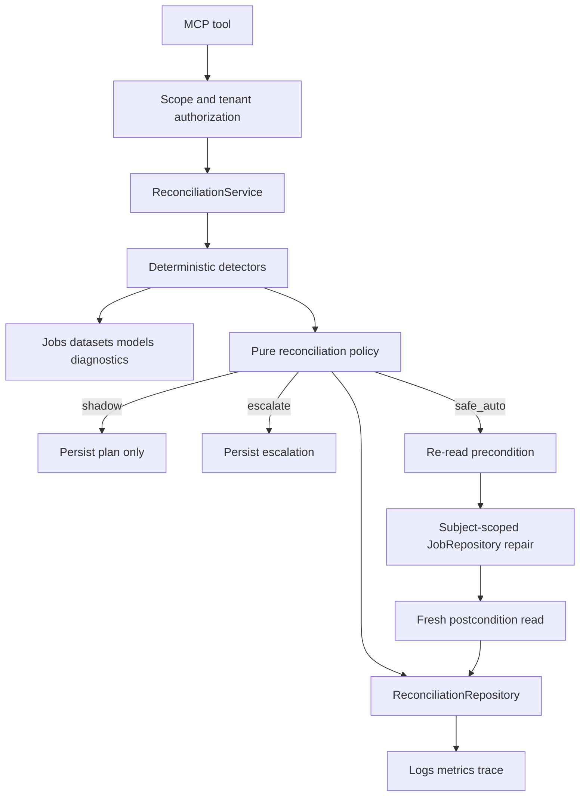

# Marketing Reconciliation Engine - Staff Engineer Execution Brief

This document is the engineer-facing execution companion to `docs/plans/2026-09-12-0919-feat-marketing-reconciliation-engine-plan.md`.

The canonical plan owns product behavior, R1-R19, scope, and safety intent. This brief owns the implementation shape, coding order, integration boundaries, review checkpoints, and execution context engineers need to build the feature without re-opening product decisions.

If this brief conflicts with a product requirement in the canonical plan, the canonical plan wins. If the canonical plan leaves an implementation detail open, this brief is the implementation authority for the first v1 build.

The detailed task ledger lives in `docs/plans/2026-09-12-0919-feat-marketing-reconciliation-engine-tasks.md`.

---

## Engineer Brief

```toon
brief:
  outcome: bounded reconciliation for machine-checkable marketing workflow faults
  first_release: shadow-first plus one internal safe repair
  safe_repair: subject-scoped expired worker lease recovery
  public_surface: four MCP tools
  mutation_scope: marketing:reconcile
  provider_actuation: deferred
  new_broker_or_queue: forbidden
  model_retuning_as_repair: forbidden
  ui_work: none
  implementation_style: test-first vertical slices
```

The first release proves one thing well: the repository can detect a real fault, persist one durable incident, decide whether the fault is safe to repair, execute a bounded repair through the existing owner, verify the postcondition, and refuse to act when the truth is uncertain.

Do not treat this feature as a general automation framework. Do not build extension points for future providers. Do not add a scheduler, event bus, generic recipe plugin API, orchestration engine, or UI in anticipation of later phases.

---

## Source of Truth Order

```toon
authority[6]{rank,source,owns}:
  1,docs/plans/2026-09-12-0919-feat-marketing-reconciliation-engine-plan.md,product behavior and R1-R19
  2,docs/DECISION-INTEGRITY.md,statistical decision safety
  3,AGENTS.md,repository engineering and agent constraints
  4,this brief,implementation shape and coding order
  5,marketing reconciliation tasks file,atomic execution ledger
  6,engineer judgment,details not fixed above
```

An engineer may choose local names or helper placement when the choice does not change behavior, ownership, persistence semantics, authorization, or test evidence.

An engineer must stop and update the plan before changing a requirement, action mode, public tool contract, tenant boundary, persistent lifecycle, or automatic repair class.

---

## Context Lenses

Every task in the execution ledger names the lenses that must be loaded before changing code.

```toon
lenses[9]{id,name,read_first,question}:
  L0,Product Contract,source plan,Does this preserve R1-R19 and the explicit non-goals
  L1,Decision Safety,docs/DECISION-INTEGRITY.md and domain/diagnostics/gate.py,Can this action bypass or reinterpret a statistical gate
  L2,Jobs and Concurrency,jobs/repository.py jobs/state.py jobs/process_worker.py,Is the action atomic idempotent fenced and restart-safe
  L3,Persistence,persistence.py repositories/base.py storage/migrations.py storage/metadata.py,Who owns durable state and what survives restart
  L4,Security and Tenancy,security/policy.py principal and auth integration tests,Can one scope or tenant cross another boundary
  L5,MCP and Capability,mcp/tools server capabilities and discovery tests,Does public discovery match executable behavior
  L6,Observability,observability logging metrics traces and G4 tests,Can an operator explain the action without leaking data
  L7,Release Evidence,PRODUCTION-READINESS and AQG H5 evidence,What does current executable proof actually establish
  L8,Simplicity,current repository pattern and Ponytail constraints,Can existing code own this with fewer new abstractions
```

### Lens rules

L0 and L8 apply to every task.

L1 applies to every model or decision-facing task.

L2 applies to every job-recovery or retry task.

L3 applies to schema, repository, restart, or idempotency work.

L4 applies to every MCP operation and every incident read or mutation.

L5 applies when a tool, capability, schema, discovery surface, or generated contract changes.

L6 applies before emitting any metric, log, trace field, or persisted evidence snapshot.

L7 applies before changing capability maturity, readiness claims, or release evidence.

---

## Staff Engineer Design Refinements

The product contract stays unchanged. These refinements remove implementation ambiguity found during engineer review.

### SE-KTD1. Use a dedicated reconciliation repository on the existing persistence backend

Do not add incident methods to the broad `MetadataRepository` interface.

Add a narrow `ReconciliationRepository` contract and a SQLite implementation that uses the existing database and migration runner. Add it to `PersistenceBackend` beside jobs and credentials.

Why:

- incidents and attempts have their own lifecycle, queries, tenant filtering, and dedup semantics
- the repository already uses domain-specific repositories for jobs and credentials
- a dedicated repository prevents `MetadataRepository` from becoming a grab bag
- this is not a new persistence platform; it reuses the existing SQLite connection and migration path

Expected ownership:

```toon
persistence_ownership[4]{concern,owner}:
  incident domain rules,domain/reconciliation.py
  incident durable queries,ReconciliationRepository
  sqlite schema and transactions,SQLiteReconciliationRepository plus MigrationRunner
  composition,PersistenceBackend and Application
```

### SE-KTD2. Model shadowing as an action outcome, not a terminal incident state

The incident stays active while the underlying invariant is still violated.

A shadow evaluation records a planned action and evidence, but it must not close the incident merely because the engine observed it.

Use a small incident lifecycle such as:

```toon
incident_states[6]{state,meaning,active}:
  open,Invariant is violated and diagnosis exists,true
  actionable,Preconditions support a registered remedy,true
  verifying,An action ran and postcondition evaluation is pending,true
  healed,The invariant no longer holds,false
  escalated,Automatic repair is not justified,false
  failed,Execution failed and needs operator attention,false
```

`shadow` remains an `ActionMode`. It is stored on the plan or attempt, not as a terminal incident state.

This preserves R3. Repeated shadow scans of the same unresolved condition converge on the same active incident.

### SE-KTD3. Add a subject-scoped atomic stale-job recovery operation

The existing `recover_stale_running_jobs()` is a batch startup operation. It can mutate every eligible stale running job.

A single reconciliation incident must never invoke that batch method as its actuator.

Add a repository-owned subject-scoped operation that atomically checks one job and changes only that job when all recovery predicates still hold.

The operation must preserve the same semantics as the current batch path:

- status is `running`
- the lease exists and is expired
- attempts below max attempts requeue the job with `WORKER_LEASE_EXPIRED`
- attempts at max attempts fail the job with `WORKER_ATTEMPTS_EXHAUSTED`
- lease owner and expiry are cleared after recovery
- fencing remains effective against stale worker completion
- live leases are no-op
- cancelling or cancelled jobs are no-op
- tenant mismatch fails closed before mutation

Keep `recover_stale_running_jobs()` for startup recovery. It may share a predicate or lower-level SQL helper only if that reduces duplication without weakening atomicity.

### SE-KTD4. Keep recipes static in v1

Do not introduce a dynamic registry interface for one automatic repair.

Use a small typed recipe key and explicit dispatch inside the reconciliation service or a small policy module.

Extract a registry only after a second materially different safe recipe exists and proves that direct dispatch is becoming harder to read or test.

### SE-KTD5. Separate detection evidence from action authority

Detectors produce structured facts. They do not decide whether to mutate.

Policy maps facts to an action mode and recipe key.

The service coordinates persistence, authorization, action, and verification.

The domain owner performs the actual state mutation.

```toon
ownership_chain[5]{step,owner}:
  detect,detector function using existing domain owner reads
  classify,reconciliation domain policy
  authorize,MCP security policy plus tenant checks
  mutate,existing domain repository or service owner
  verify,reconciliation service using fresh post-action read
```

### SE-KTD6. Fingerprints contain stable identity, not volatile evidence

The incident fingerprint must be stable across repeated scans of the same unresolved fault.

Recommended semantic inputs:

```toon
fingerprint[5]{field,example}:
  tenant_id,tenant-a
  fault_code,WORKER_LEASE_EXPIRED
  subject_kind,job
  subject_id,job-123
  invariant_version,v1
```

Do not include timestamps, trace IDs, lease expiry values, warning text, request IDs, or current metric values in the fingerprint.

Use the repository's existing hashing conventions if a suitable semantic hashing helper already exists. Do not add a new hashing dependency.

### SE-KTD7. Evidence records are references and compact snapshots

Persist enough evidence to explain a decision, but do not copy raw datasets, model artifacts, posteriors, credentials, or full external payloads.

Recommended evidence shape:

```toon
evidence[7]{field,purpose}:
  source_type,job dataset model diagnostic policy
  source_id,stable repository object id
  source_version,updated_at fence token fingerprint or diagnostic revision when available
  observed_state,small allowlisted state snapshot
  finding_codes,stable machine-readable findings
  trace_id,correlation when safe
  captured_at,observation timestamp
```

### SE-KTD8. Capability maturity follows tests, never the plan

New tools enter `src/marketing_mcp/capabilities.py` as `experimental`.

Do not mark them stable in the same coding step that creates them unless the repository's normal evidence requirements are already satisfied by fresh executable tests.

Do not use the existence of this plan, this brief, or the task ledger as release evidence.

---

## Proposed Runtime Shape



The service is a coordinator, not the owner of job-state SQL, dataset validation, model diagnostics, or model-dependent calculations.

---

## Persistence Contract

### Incident record

The exact class or schema name is an implementation choice. Preserve these semantics.

```toon
incident_fields[15]{field,required,notes}:
  incident_id,yes,opaque stable id
  tenant_id,yes,authorization partition
  owner,yes,request owner or service owner
  fingerprint,yes,stable dedup key
  fault_class,yes,operational data_integrity epistemic commercial
  fault_code,yes,stable machine code
  subject_kind,yes,job dataset model or future type
  subject_id,yes,repository object id
  state,yes,incident lifecycle
  action_mode,yes,current policy mode
  recipe_key,no,only when a registered recipe exists
  evidence,yes,compact allowlisted evidence
  policy_version,yes,explains why a decision was made
  first_seen_at,yes,first detection time
  last_seen_at,yes,latest confirming scan
```

Terminal records also need `resolved_at` or equivalent terminal timestamp.

### Attempt record

```toon
attempt_fields[13]{field,required,notes}:
  attempt_id,yes,opaque stable id
  incident_id,yes,parent incident
  tenant_id,yes,defense in depth
  actor_subject,yes,who requested execution
  action_mode,yes,shadow safe_auto approval_required prohibited
  recipe_key,no,registered recipe when present
  idempotency_key,yes,stable retry identity
  precondition,yes,compact evaluated facts
  before_evidence,yes,reference or compact snapshot
  action_result,no,allowlisted result
  verification,yes,pass fail or not_run with evidence
  outcome,yes,no_op planned healed failed escalated denied
  created_at,yes,audit ordering
```

### Deduplication

Enforce one active incident per tenant plus fingerprint at the persistence boundary where practical.

A partial unique index is acceptable for SQLite if it remains clear and covered by migration tests. Do not rely only on a service-level read-then-insert check because concurrent scans can race.

### Attempt idempotency

A retry of the same requested action must not create a second state mutation.

The attempt idempotency key should include the incident identity, recipe key, relevant policy version, and the stable precondition generation that makes a retry the same business action.

Do not use a random UUID as the semantic idempotency key.

---

## Fault Detectors in v1

```toon
detectors[4]{id,subject,trigger,mode,repair}:
  D1,job,expired running lease,shadow then safe_auto,subject-scoped stale lease recovery
  D2,dataset,blocking validation findings,shadow or escalation,none
  D3,model,missing or rejected decision state,escalation,none
  D4,model,approved_with_caution warnings,shadow observation,none
```

### D1. Expired running job lease

Read job state through `JobRepository`.

Do not detect expiration by parsing logs.

The detector must distinguish:

- running with live lease: healthy for this invariant
- running with expired lease and retries left: recoverable operational fault
- running with expired lease and attempts exhausted: recoverable to terminal failed state, but not requeueable
- cancelling or cancelled: not eligible for stale-running recovery
- queued, failed, or succeeded: not an expired-running incident

### D2. Dataset blocking validation

Use `DatasetService.validate` or the stable service seam that owns current validation.

Persist stable finding codes and a compact summary. Do not persist raw rows.

Do not auto-edit data.

### D3 and D4. Model diagnostic state

Use stored model and diagnostic state. Preserve existing `DecisionGate` semantics.

A rejected or undiagnosed model is an epistemic block. It is not a repair target.

An approved-with-caution model remains usable according to current decision rules, but reconciliation must preserve warnings and must not label the caution itself as healed.

When useful, attach the existing `recommend_next_measurement` output as guidance. Guidance is not an actuator.

---

## MCP Contract

Expose only these operations in v1.

```toon
mcp_tools[4]{tool,scope,mutation,purpose}:
  scan_marketing_health,marketing:reconcile,reconciliation metadata only,detect and refresh incidents
  list_reconciliation_incidents,marketing:read,none,list authorized incidents
  get_reconciliation_incident,marketing:read,none,inspect one authorized incident
  reconcile_incident,marketing:reconcile,allowlisted internal repair only,evaluate or execute current policy
```

### MCP input rules

Do not accept:

- arbitrary code
- arbitrary tool names
- SQL
- shell commands
- callback URLs
- provider access tokens
- dynamic recipe modules
- arbitrary target tenant IDs outside the current principal context

A repair request identifies an incident. The server resolves the current recipe and policy from persisted and fresh state.

Do not let the caller send `force=true` or choose `safe_auto` when policy returns shadow, approval-required, or prohibited.

### Tool response rules

Return stable machine fields for incident state, action mode, finding codes, verification outcome, warnings, and next actions.

Keep evidence compact. Never return another tenant's existence through a distinguishable error path when the existing authorization model expects not-found style isolation.

---

## Coding Orders

The implementation must follow this order unless fresh repository evidence invalidates a dependency.

```toon
coding_orders[10]{order,objective,entry_gate,exit_gate}:
  CO0,Refresh baseline and characterize current seams,main at expected baseline,context notes match current code
  CO1,Lock domain types lifecycle policy and fingerprint tests,CO0,domain tests define illegal states and fail closed
  CO2,Add durable repository and migrations,CO1,restart dedup and tenant tests pass
  CO3,Build shadow detectors and scan orchestration,CO2,shadow integration has zero underlying repair side effects
  CO4,Add subject-scoped atomic job recovery,CO0,job recovery characterization and race tests pass
  CO5,Wire safe_auto detect act verify loop,CO3 CO4,full recovery loop is idempotent and fenced
  CO6,Expose scopes MCP tools and capability entries,CO3 CO5,protocol auth tenant and discovery tests pass
  CO7,Add metrics logs traces and agent negative evidence,CO5 CO6,observability and AQG H5 tests pass
  CO8,Update docs and generated capability inventory,CO6 CO7,docs and runtime contracts agree
  CO9,Run integrated verification and independent review,CO8,definition of done is proven on final diff
```

### Coding order rule

Do not start a downstream order because the upstream code exists. Start only when the upstream exit gate has fresh evidence.

A failed exit gate sends the work back to the owning order. Do not patch around the gate in a downstream layer.

---

## Execution Protocol for Every Coding Task

Use this sequence for every feature-bearing task.

```toon
task_protocol[8]{step,action}:
  1,Read the named context lenses and exact current files
  2,State the invariant and prohibited side effect
  3,Write or identify the focused failing test
  4,Make the smallest coherent implementation change
  5,Run the focused test and inspect the full result
  6,Run adjacent contract tests that share the changed boundary
  7,Inspect the diff for scope auth data and generated-file drift
  8,Update the task ledger only after evidence exists
```

Do not combine speculative cleanup with a feature task.

Do not refactor an unrelated module because the new feature made its style noticeable.

When a task reveals a load-bearing contract mismatch, stop the task and revise the plan rather than hiding the decision in code.

---

## File Ownership and Expected Touch Surface

```toon
files[19]{path,role,expected_change}:
  src/marketing_mcp/domain/reconciliation.py,domain contract,new
  src/marketing_mcp/repositories/reconciliation.py,reconciliation persistence protocol plus sqlite implementation,new
  src/marketing_mcp/storage/migrations.py,schema evolution,modify
  src/marketing_mcp/persistence.py,persistence composition,modify
  src/marketing_mcp/app.py,service composition,modify
  src/marketing_mcp/jobs/repository.py,subject-scoped stale recovery,modify
  src/marketing_mcp/services/reconciliation_service.py,reconciliation coordinator,new
  src/marketing_mcp/security/policy.py,marketing:reconcile scope and tool mapping,modify
  src/marketing_mcp/mcp/tools/reconciliation.py,public tool handlers,new
  src/marketing_mcp/mcp/server.py,tool registration,modify
  src/marketing_mcp/capabilities.py,experimental capability declarations,modify
  tests/unit/test_reconciliation_domain.py,domain proof,new
  tests/integration/test_reconciliation_persistence.py,persistence proof,new
  tests/integration/test_reconciliation_shadow.py,shadow proof,new
  tests/integration/test_reconciliation_recovery.py,safe repair proof,new
  tests/integration/test_reconciliation_auth.py,auth and tenant proof,new
  tests/integration/test_mcp_protocol.py,protocol regression,modify
  tests/integration/test_mcp_discovery_snapshot.py,discovery regression,modify
  docs/RECONCILIATION.md,operator and developer contract,new
```

Other files may change only when a named task proves they are necessary. Any unexpected touch to provider code, dashboard code, model math, sampling configuration, or release publication configuration requires a plan review before proceeding.

---

## Integration Hotspots

### Persistence connection ownership

`SQLiteMetadataStore` currently owns the SQLite connection used by jobs. If `SQLiteReconciliationRepository` reuses that connection, tests must prove migrations, commits, and transaction boundaries do not leave the connection in a broken transaction state.

Do not open an unrelated second SQLite database for incidents.

### Batch recovery versus incident recovery

Startup recovery and incident recovery share semantics but have different blast radius.

The batch method remains broad and startup-oriented.

The incident actuator is narrow and subject-scoped.

Do not make the reconciliation service call the batch method and then infer that only one incident changed.

### Tenant authorization

Persistence filtering is defense in depth, not a replacement for request authorization.

The MCP handler resolves the principal and scope. The service carries tenant context. The repository query also constrains tenant ownership where a tenant is available.

### Decision gate

Reconciliation does not call decision-grade tools to determine whether a rejected model is healthy.

The persisted decision state and diagnostic owner remain authoritative.

### Capability registry

Do not hand-edit generated `docs/CAPABILITIES.md` as an independent source. Change `src/marketing_mcp/capabilities.py`, run the generator, and keep discovery tests in sync.

---

## Concurrency and Race Conditions

The following races require explicit tests.

```toon
races[7]{race,required_behavior}:
  duplicate_scan,two scans converge on one active tenant fingerprint
  repair_vs_lease_renewal,atomic precondition prevents recovery of a newly renewed live lease
  repair_vs_worker_finish,fence prevents stale worker result from publishing after recovery
  repair_vs_cancel,cancelling or cancelled job is not resurrected
  retry_after_success,second request is no-op and does not repeat mutation
  process_restart,incident and attempts survive and remain interpretable
  tenant_collision,same subject id across tenants cannot cross incident ownership
```

Avoid global locks in application code when the database can enforce the invariant transactionally.

For SQLite, use the repository's established transaction style. Do not introduce a custom distributed locking layer.

---

## Failure Semantics

```toon
failures[9]{condition,incident_outcome,mutation_allowed}:
  invariant_disappeared,no_op,false
  unknown_fault,escalated,false
  epistemic_uncertainty,escalated,false
  missing_scope,denied,false
  tenant_mismatch,denied,false
  stale_precondition,no_op,false
  action_exception,failed,false_after_exception
  verification_failed,escalated,false_after_attempt
  postcondition_passed,healed,true_completed
```

An action exception must not erase the attempt record.

A verification failure must not be normalized to healed because the actuator returned success.

A no-op is not a failure when fresh state proves the invariant no longer exists.

---

## Observability Contract

Use low-cardinality labels only.

Acceptable metric dimensions include:

- fault class
- fault code from a bounded catalog
- action mode
- recipe key from a bounded catalog
- terminal outcome

Do not use these as metric labels:

- tenant ID
- job ID
- model ID
- dataset ID
- incident ID
- trace ID
- owner subject

Those identities may appear in structured logs or traces only under existing redaction and privacy rules.

Every automatic attempt must be reconstructable from logs plus persisted incident and attempt records without reading raw customer data.

---

## Security Review Contract

The first security review must prove these negative cases.

```toon
security_cases[8]{case,expected}:
  read_scope_calls_reconcile,AUTH_FORBIDDEN
  reconcile_scope_reads_other_tenant,fail_closed_without_evidence_leak
  caller_requests_force,request_rejected_or_ignored_by_schema
  caller_supplies_recipe,server_resolves_recipe_not_caller
  rejected_model_requests_repair,no_model_mutation
  secret_sentinel_in_evidence,redacted_or_rejected
  cross_tenant_incident_id,no protected evidence returned
  unknown_fault_code,no mutation
```

Do not add `marketing:reconcile` to existing remote principals implicitly outside the current auth configuration model. The scope catalog may know the scope, but production OAuth assignment remains an operator or identity-provider decision.

---

## Test Strategy

### Layer 1. Domain tests

Fast tests for lifecycle, policy, fingerprints, action-mode denial, and invalid transitions.

### Layer 2. Repository tests

Real SQLite tests for schema migration, dedup, tenant filtering, append-only attempt history, retry identity, transaction rollback, and restart.

### Layer 3. Service integration tests

Real repository plus real service collaborators where practical. Prove shadow side-effect absence and postcondition verification.

### Layer 4. Job concurrency tests

Prove subject-scoped recovery does not break current lease, fencing, cancellation, or startup batch recovery semantics.

### Layer 5. MCP and auth tests

Prove discovery, tool contracts, scope mapping, tenant isolation, and fail-closed negative paths.

### Layer 6. Observability and agent safety

Prove low-cardinality metrics, redaction, trace correlation, and no prompt-level bypass.

### Layer 7. Full repository regression

Run the existing fast, statistical, type, lint, docs drift, capability, and build gates from the canonical plan.

Long statistical or full verification runs may use a detached process facility when the execution host supports one, but the implementation session must collect the final result before claiming completion.

---

## Staff Engineer Review Checkpoints

### Checkpoint C1. Domain and persistence frozen

Required before detector work expands.

Evidence:

- domain transition tests green
- fingerprint test proves stable dedup identity
- migration from current schema preserves existing data
- same fingerprint and tenant cannot create two active incidents
- same fingerprint across tenants remains isolated

### Checkpoint C2. Shadow mode trustworthy

Required before any automatic repair is wired.

Evidence:

- D1-D4 detect expected conditions
- clean state produces no incident
- repeated scan converges
- underlying job, model, dataset, and scenario state remains unchanged
- warnings remain visible

### Checkpoint C3. Safe repair trustworthy

Required before `reconcile_incident` can execute `safe_auto`.

Evidence:

- only one job is in actuator scope
- live lease is not recovered
- cancellation is preserved
- stale worker result is fenced
- repeated repair is no-op
- postcondition failure does not heal

### Checkpoint C4. Public boundary trustworthy

Required before documentation calls the capability usable.

Evidence:

- scope matrix passes
- cross-tenant negatives pass
- discovery and registry match
- no caller-controlled arbitrary recipe or force path exists
- experimental capability status is truthful

### Checkpoint C5. Integrated closeout

Required before marking the task ledger complete.

Evidence:

- focused reconciliation suites green
- existing job and security suites green
- statistical suite green where current repository evidence requires it
- ruff and pyright green
- capability and docs drift checks green
- package build green
- independent diff review finds no P0 or P1 issue

---

## Parallel Work Policy

Keep one writer for shared contracts.

After CO2 freezes the domain and persistence contracts, D1, D2, and D3 detector test exploration may happen independently. Integrate them through one owner of `ReconciliationService`.

MCP authorization and observability review can be read in parallel after CO5, but edits to `security/policy.py`, `capabilities.py`, and shared integration fixtures should remain serialized.

Do not parallelize migrations, repository protocol changes, or the subject-scoped job recovery change with code that depends on their final contract.

---

## Coding Stops and Replan Triggers

Stop implementation and revise the brief or canonical plan if any of these occur:

```toon
replan_triggers[10]{trigger}:
  safe repair requires changing model priors or diagnostic thresholds
  a second external platform actuator enters scope
  incident persistence requires a new database or broker
  tenant ownership cannot be expressed with current principal context
  subject-scoped job recovery cannot preserve fencing atomically
  shadow mode requires mutation outside reconciliation metadata
  capability requires a new public action mode
  a provider token must be stored in incident evidence
  current production hardening issue blocks local contract proof
  a new requirement changes R1-R19
```

Do not solve a replan trigger by hiding the new decision in a helper or feature flag.

---

## Explicit Non-Work

```toon
non_work[12]{item}:
  Google Ads connector
  Meta Ads connector
  LinkedIn Ads connector
  live campaign pause or resume
  budget mutation
  bid strategy mutation
  target CPA or target ROAS mutation
  audience or creative mutation
  model auto retuning
  generic workflow engine
  reconciliation dashboard
  dynamic recipe plugin framework
```

Shiro and Impeccable have no implementation role in this v1 because the plan has no frontend surface. If a dashboard enters scope later, treat it as a separate product and UI plan.

---

## External Constraints That Remain Relevant

The controller pattern remains the right mental model: observe current state, compare it with the allowed desired state, make a bounded change, and reconcile again. Idempotency is required because the loop may repeat after retries, restarts, or unrelated events.

Google Ads guidance continues to support deferring commercial actuation. Conversion data can arrive after the click, and changes to conversion goals or bidding inputs can trigger additional learning cycles. A future platform controller must operate at a slower supervisory layer instead of fighting the platform's own bidding loop.

Current references:

- Kubernetes Controllers: https://kubernetes.io/docs/concepts/architecture/controller/
- Kubebuilder reconciliation good practices: https://book.kubebuilder.io/reference/good-practices.html
- Google Ads conversion delay: https://support.google.com/google-ads/answer/6239119?hl=en
- Google Ads changes to conversion goals used by Smart Bidding: https://support.google.com/google-ads/answer/14571185?hl=en

---

## Engineer Handoff

Start with CO0 and `T00` in the task ledger.

Do not start by creating MCP tools. Do not start by writing the service. The first implementation artifact is the domain contract and its failing tests. The first mutation-capable artifact arrives only after shadow behavior and subject-scoped job recovery are independently proven.

The implementation is complete only when the canonical plan's Definition of Done is satisfied with fresh evidence on the final integrated commit.