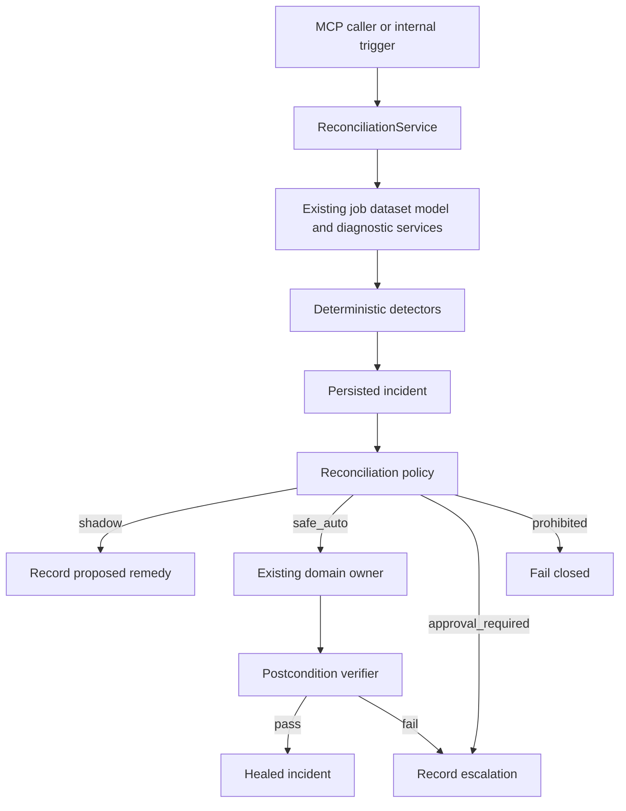
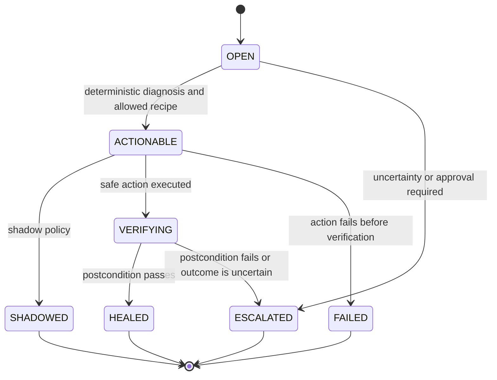
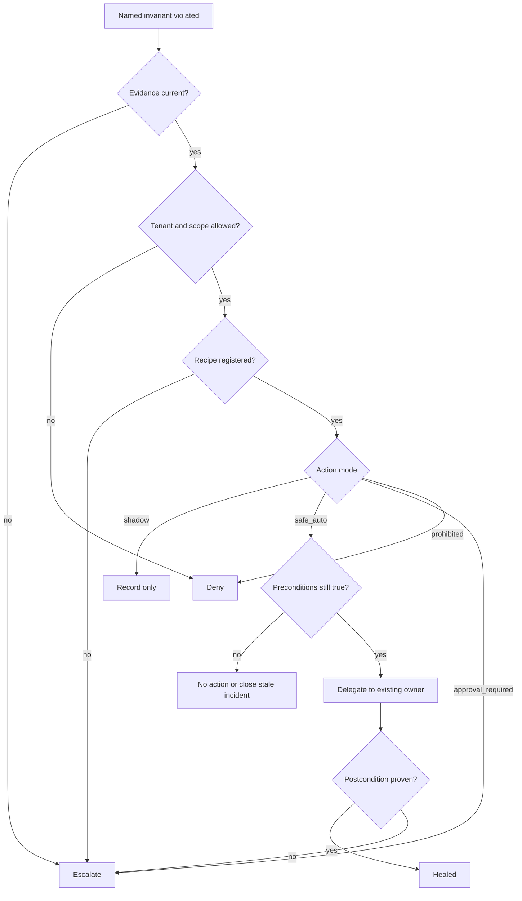

# Marketing Reconciliation Engine - Plan

## Goal Capsule

**Objective:** Operators and MCP agents can detect, explain, and safely reconcile machine-checkable faults in marketing analysis workflows without turning ordinary performance variance or statistical uncertainty into unauthorized business changes.

**Means:** Add a bounded Marketing Reconciliation Engine around the repository's existing validation, diagnostics, job recovery, authorization, persistence, and observability seams. Start in shadow mode, allow automatic mutation only for explicit low-risk internal recipes, verify every attempted repair, and escalate when the truth is uncertain. (KTD1, KTD2, KTD4)

**Authority:** Product requirements and existing decision-integrity rules outrank reconciliation policy. Reconciliation policy outranks agent preference. PyMC-Marketing remains the source of model-dependent calculations. No agent instruction may bypass a rejected diagnostic state or a reconciliation policy denial.

**Execution profile:** Build test-first in small vertical slices. Keep the first release provider-neutral and reuse current repository patterns before adding new infrastructure.

**Stop conditions:** Stop automatic action when an invariant cannot be checked, evidence is stale, ownership cannot be proven, a decision-grade model is rejected, a required dependency is unavailable, the repair is not explicitly allowlisted, or verification cannot establish the postcondition.

---

## Product Contract

### Summary

Add a self-healing capability as a constrained reconciliation loop rather than a free-form autonomous growth agent. The first version detects internal operational, data-quality, and decision-safety incidents; persists evidence; proposes a typed remedy; applies only explicitly safe internal repairs; verifies the outcome; and records escalation when no trustworthy repair exists.

The first version does not change live ad-platform budgets, bid strategies, targeting, creatives, conversion goals, or experiment traffic. Those actions require provider integrations, shadow evidence, platform-specific cooldown rules, and a separate follow-up plan.

### Problem Frame

The repository already has many ingredients required for safe reconciliation: dataset validation, MMM diagnostics, persisted decision states, `DecisionGate`, scenario persistence, durable job leases and fencing, idempotency, request-scoped identity, tenant authorization, structured logging, metrics, and `recommend_next_measurement`. What it lacks is one stateful boundary that turns a detected fault into an incident, decides whether the fault is safely repairable, records the proposed action, verifies the result, and escalates when the system cannot know enough to act.

Marketing failures are not one category. A crashed worker or expired lease is an operational fault with a checkable postcondition. A rejected MMM is evidence that decision-grade actions must stop, not an invitation to change priors until the model passes. A recent ROAS decline can be real market movement, conversion delay, noise, or a platform learning effect. Treating all three as equivalent "issues" would make the healing layer a source of new failures.

The product therefore needs an explicit boundary between restoring correctness and making a commercial decision under uncertainty.

### Key Decisions

- **Define self-healing as bounded reconciliation, not open-ended autonomous marketing management.** The engine may act only when the precondition, permitted remedy, and postcondition are machine-checkable. Governs R1-R7. (session-settled: user-approved - chosen over a free-form autonomous growth agent because marketing underperformance is often uncertain rather than broken)
- **Ship shadow-first and keep commercial mutation out of v1.** The first version records what it would do and enables only a narrow internal safe-repair path after explicit policy checks. Governs R4, R8-R12. (session-settled: user-approved - chosen over immediate live campaign mutation because provider learning loops and conversion delay make fast external changes unsafe)
- **Preserve epistemic uncertainty as a valid outcome.** When current evidence cannot establish a correct repair, the engine escalates or requests more measurement instead of forcing a pass. Governs R6, R7, R13.

### Requirements

**Fault and incident semantics**

- R1. A reconciliation incident exists only when a named invariant or policy condition is violated; a KPI movement alone is not an incident.
- R2. Every incident records its tenant and owner context, fault class, subject identity, evidence references, detection time, current state, and a stable fingerprint used for deduplication.
- R3. Repeated scans of the same unresolved condition converge on the same active incident rather than creating duplicate incidents.
- R4. Every proposed remedy declares one action mode: `shadow`, `safe_auto`, `approval_required`, or `prohibited`.

**Decision safety**

- R5. The engine may never weaken or bypass `DecisionGate`, persisted diagnostic states, dataset validation, ownership checks, budget constraints, or existing domain errors.
- R6. A rejected or undiagnosed MMM is not automatically refit, retuned, recalibrated, or modified by reconciliation. The engine records the block and may use `recommend_next_measurement` to provide evidence-gathering guidance.
- R7. Epistemic failures such as unclear causality, insufficient history, unsupported extrapolation, or ambiguous performance deterioration terminate in escalation rather than an invented repair.

**Action and verification**

- R8. Shadow mode performs no business or infrastructure mutation beyond recording the incident and its proposed plan.
- R9. `safe_auto` is deny-by-default. A recipe becomes eligible only when its precondition, action, postcondition, idempotency behavior, and failure behavior are explicitly registered and tested.
- R10. Every executed remedy stores a before-state evidence reference, action identity, idempotency key, result, verification evidence, and terminal outcome.
- R11. Re-running a completed safe recipe must converge on the same valid end state or produce a no-op; it must not duplicate effects.
- R12. If an action succeeds but verification fails, the incident remains non-healed and records either rollback evidence or escalation. A successful API call alone never proves healing.

**Public and security contract**

- R13. The MCP surface exposes incident scanning, incident inspection, and bounded reconciliation without exposing arbitrary code, shell, SQL, provider credentials, or unrestricted mutation.
- R14. Read-only incident inspection uses the existing read authority. Incident creation or repair requires a distinct `marketing:reconcile` scope so statistical read or decision permissions do not imply repair authority.
- R15. Tenant and object authorization applies at detection, inspection, action, and verification. Cross-tenant incident access and repair fail closed.
- R16. Public reconciliation capabilities enter the capability registry as `experimental` until their listed executable evidence tests exist and pass.

**Observability and evidence**

- R17. Reconciliation emits low-cardinality metrics and correlated logs for detection, plans, attempts, verification, healing, failure, and escalation without using tenant IDs, model IDs, job IDs, or customer data as metric labels.
- R18. Logs and persisted evidence must not contain raw credentials, raw customer rows, full posterior samples, or provider tokens.
- R19. The engine records enough provenance to explain which model, dataset, diagnostic state, job state, and policy version informed an incident without copying large underlying artifacts into incident records.

### Fault Classification

```toon
fault_classes[4]{class,meaning,v1_action,example}:
  operational,Execution state is wrong,Safe repair may be allowed,Expired worker lease
  data_integrity,Input is invalid or stale,Shadow or escalate,Dataset validation failure
  epistemic,Truth is not known well enough,Escalate or measure,Rejected MMM or weak identification
  commercial,Business performance may be suboptimal,Observe only in v1,ROAS decline
```

### Autonomy Contract

```toon
autonomy[4]{mode,authority,v1_status,mutation}:
  shadow,Detect diagnose and record,Default,No external mutation
  safe_auto,Run allowlisted reversible internal recipe,Enabled only by recipe,Internal only
  approval_required,Prepare action for a human decision,Represented but not executed,No automatic mutation
  prohibited,Refuse action,Always enforced,No mutation
```

### Key Flows

- F1. **Shadow detection**
  - **Trigger:** A caller invokes the health scan against an authorized subject.
  - **Steps:** Existing services expose current evidence; detectors evaluate named invariants; the engine deduplicates or creates incidents; policy produces a shadow plan.
  - **Outcome:** The incident is inspectable with evidence and no repair side effect.
  - **Covered by:** R1-R4, R8, R13-R19.

- F2. **Safe internal repair**
  - **Trigger:** An incident matches an allowlisted internal recipe whose preconditions still hold.
  - **Steps:** Authorization is rechecked; the engine records before-state evidence; it invokes the existing owner of the repair; it verifies the postcondition; it persists the attempt and terminal state.
  - **Outcome:** The incident becomes healed only when verification passes.
  - **Covered by:** R5, R9-R12, R14-R19.

- F3. **Uncertain diagnosis**
  - **Trigger:** A rejected model, blocked dataset, or ambiguous performance signal has no deterministic repair.
  - **Steps:** The engine records why automatic action is not justified and, where applicable, surfaces `recommend_next_measurement` guidance.
  - **Outcome:** The incident becomes escalated without changing statistical configuration or commercial settings.
  - **Covered by:** R5-R7, R12.

- F4. **Retry and restart**
  - **Trigger:** The same scan or repair request is repeated after a process restart or client retry.
  - **Steps:** The engine reloads the incident and prior attempts, applies the stable fingerprint and idempotency contract, and evaluates current state again.
  - **Outcome:** The request converges without duplicate incidents or duplicate side effects.
  - **Covered by:** R2, R3, R10, R11, R15.

### Acceptance Examples

- AE1. **Duplicate scan:** Given an expired job lease already represented by an open incident, when the same health scan runs again, then the engine updates or returns that incident and does not create a second active incident. Covers R2, R3.
- AE2. **Safe recovery:** Given an actually expired leased job that existing job recovery semantics can safely recover, when `safe_auto` reconciliation is requested with valid scope, then the engine invokes the existing recovery owner and marks the incident healed only after the repository state proves recovery. Covers R5, R9-R12, R14.
- AE3. **Live lease protection:** Given a running job whose lease is still valid, when the engine evaluates it, then no repair is attempted and no active fault is fabricated. Covers R1, R5, R9.
- AE4. **Rejected model:** Given an MMM with persisted `rejected` decision status, when health scanning evaluates it, then the engine never changes model priors or calls decision-grade budget tools; it records escalation and may attach measurement guidance. Covers R5-R7.
- AE5. **Shadow safety:** Given any actionable incident in shadow mode, when reconciliation is requested, then a plan and expected postcondition are persisted but the underlying job, model, dataset, and scenario state stay unchanged. Covers R4, R8, R10.
- AE6. **Cross-tenant denial:** Given a principal from tenant B and an incident owned by tenant A, when tenant B reads or reconciles the incident, then the operation fails closed and no evidence from tenant A is returned. Covers R14, R15.

### Success Criteria

- Every v1 automatic action is backed by an explicit recipe and executable negative tests proving that near-miss states are not mutated.
- Every executed remedy has a persisted before-state, result, verification result, actor, tenant, trace context, and terminal outcome.
- Shadow mode has zero underlying repair side effects in unit, contract, and integration evidence.
- Repeated scans and repeated safe-repair requests are idempotent under restart and retry tests.
- A rejected or uncertain statistical state always remains visible and cannot be converted into a decision-ready state by reconciliation policy alone.
- Public capability status and documentation never claim stable reconciliation before the named evidence tests pass.

### Scope Boundaries

**In this plan**

- Reconciliation domain types, lifecycle rules, and policy modes.
- Durable incident and action-attempt persistence using current repository patterns.
- Internal detectors for job recovery state, dataset validation state, and MMM diagnostic state.
- Shadow planning for every v1 incident type.
- One safe internal remediation family that delegates to existing expired-job recovery semantics.
- MCP tools for scan, inspect, list, and bounded reconciliation.
- `marketing:reconcile` authorization, tenant isolation, provenance, logs, metrics, capability inventory, documentation, and agent-safety evidence.

**Deferred to Follow-Up Work**

- Google Ads, Meta Ads, LinkedIn Ads, analytics, CRM, or attribution provider sensor adapters.
- Conversion-tracking anomaly detection across external sources.
- Sample Ratio Mismatch and experiment-randomization health adapters.
- Automatic pause, resume, or rollback of remote campaigns.
- Any live campaign budget, target CPA, target ROAS, bid strategy, audience, creative, conversion-goal, or attribution-model mutation.
- Scheduled background reconciliation across external accounts.
- A dedicated reconciliation dashboard or frontend.
- A standalone agent skill for reconciliation. Add one only after the public tool contract is stable enough to evaluate without teaching agents an unstable API.

**Outside this product's identity**

- A free-form autonomous growth agent with unrestricted account mutation.
- A repair mechanism that changes priors, model families, variables, or diagnostic thresholds until a model passes.
- An LLM replacing PyMC-Marketing for model-dependent calculations.
- Automatic suppression of warnings, extrapolation caveats, or rejected states.

### Sources and Research

Repository evidence is pinned to baseline `e637c72fe75961ccae4f74e01d440b18e6ed35c9` for planning. Relevant current seams include `src/marketing_mcp/app.py`, `src/marketing_mcp/services/decision_service.py`, `src/marketing_mcp/domain/diagnostics/gate.py`, `src/marketing_mcp/jobs/process_worker.py`, `src/marketing_mcp/jobs/repository.py`, `src/marketing_mcp/security/policy.py`, `src/marketing_mcp/repositories/base.py`, `src/marketing_mcp/storage/metadata.py`, `src/marketing_mcp/storage/migrations.py`, `src/marketing_mcp/capabilities.py`, and `src/marketing_mcp/observability/metrics.py`.

Current product contracts are `docs/ARCHITECTURE.md`, `docs/DECISION-INTEGRITY.md`, `docs/CAPABILITIES.md`, `docs/TOOL-CONTRACTS.md`, `docs/SECURITY.md`, and `AGENTS.md`.

External guidance that shaped the plan:

- Kubernetes controller documentation describes reconciliation as a control loop that watches current state and moves it toward desired state. This supports the desired-state versus observed-state model rather than open-ended agent improvisation: https://kubernetes.io/docs/reference/command-line-tools-reference/kube-controller-manager
- Google Ads documents conversion delay and warns that recent performance can look weaker before delayed conversions arrive. Google also warns against frequent budget, target, or conversion-goal changes during Smart Bidding learning. This supports deferring fast external commercial actuation: https://support.google.com/google-ads/answer/6239119?hl=en and https://support.google.com/google-ads/answer/6270625?hl=en
- PyMC-Marketing's budget allocator is a constrained model-dependent calculation over a fitted MMM. Reconciliation must continue to consume that boundary rather than duplicate its math: https://www.pymc-marketing.io/en/stable/api/generated/pymc_marketing.mmm.budget_optimizer.BudgetOptimizer.html

---

## Planning Contract

### Current Baseline

At `e637c72`, `Application` already composes datasets, models, diagnostics, decisions, jobs, credentials, plots, and CLV. Job execution uses leased and fenced claims. Startup already calls `recover_stale_running_jobs()`. `DecisionService` enforces `DecisionGate` before decision-grade calculations. The security policy maps each MCP tool to an explicit scope. The capability registry is cross-checked against actual MCP discovery.

The plan must not infer production maturity from the baseline commit message. Open issues #7, #9, #14, #16, and #17 still track decision, worker, OAuth, shared SQL, and artifact-storage closure. The first reconciliation slice therefore relies only on behavior proven in the local repository contract and does not use unresolved provider or shared-production assumptions as evidence.

### Key Technical Decisions

- KTD1. **Use one supervisory reconciliation service over existing owners.** `ReconciliationService` detects and coordinates, but job recovery stays owned by the job repository, model status by modeling and diagnostics services, dataset validity by `DatasetService`, and model-dependent quantities by PyMC-Marketing. (session-settled: user-approved - chosen over a second autonomous control stack because the repository already has the required domain owners) Governs R1-R12.
- KTD2. **Make shadow mode the default policy and safe automation an explicit allowlist.** The engine has no generic "execute arbitrary remedy" path. (session-settled: user-approved - chosen over immediate autonomous mutation because false intervention can cost budget and corrupt learning) Governs R4, R8-R12.
- KTD3. **Keep v1 recipes explicit rather than building a dynamic plugin registry.** Represent the small initial recipe set with typed domain values and direct policy dispatch. Extract a registry abstraction only when a second implementation pattern proves the need. Governs R4, R9, R11.
- KTD4. **Treat the LLM as an explainer and caller, not an authority source.** A structured incident, policy evaluation, authorization check, and postcondition decide whether an action may run. Agent text never widens permissions. Governs R5-R9, R13-R16.
- KTD5. **Extend the existing metadata persistence contract for incident records first.** Store reconciliation incidents and attempts beside current metadata with ordered migrations. Do not add a second queue, event bus, broker, or repository framework unless implementation evidence shows the current metadata boundary cannot satisfy atomicity or ownership requirements. Governs R2, R3, R10, R15.
- KTD6. **Add `marketing:reconcile` as a distinct mutation authority.** Inspection remains compatible with `marketing:read`; scanning that persists incidents and any repair action require `marketing:reconcile`. Trusted local stdio receives the new scope through the existing catalog. Governs R13-R16.
- KTD7. **Use existing expired-lease recovery as the first safe-auto recipe.** The reconciliation layer records intent and verifies outcome but does not reimplement lease expiry, fencing, claim recovery, or cancellation rules. Governs R5, R9-R12.
- KTD8. **Do not add remote ad-platform actuators in this plan.** A future provider plan must define provider-specific change attribution, cooldowns, conversion-delay handling, rollback semantics, spend bounds, account authorization, and shadow evidence before any commercial mutation can enter `safe_auto`. Governs R1, R7-R12.

### Alternative Approaches Considered

**Free-form autonomous agent:** Rejected. It makes natural-language reasoning the action authority, cannot guarantee idempotency, and blurs operational faults with uncertain business outcomes.

**New workflow engine or event platform:** Rejected for v1. Current jobs, migrations, authorization, metrics, and composition already cover the first vertical slice. Adding another scheduler, queue, or broker before provider-scale workloads are measured would create operational surface without proving value.

**Build Google or Meta mutation first:** Rejected for v1. The repository has no provider actuation boundary today, current production hardening still has open issues, and external bidding systems already run their own learning loops. The safer sequence is to prove incident semantics and false-intervention behavior before remote money-changing actions exist.

### High-Level Technical Design

#### Component flow



#### Incident lifecycle



#### Authority decision



### Phased Delivery

```toon
milestones[5]{id,outcome,units,exit}:
  M0,Domain and persistence contract,U1 U2,Incidents survive retry and restart
  M1,Shadow reconciliation,U3,Internal faults produce deduplicated shadow incidents
  M2,First safe repair,U4,Expired lease recovery proves action plus verification
  M3,Public guarded capability,U5 U6,MCP auth observability and negative tests pass
  M4,Decision safety and documentation,U7,Capability evidence and docs match runtime
```

Promotion beyond M4 requires a separate plan. Provider sensors, experiment integrity, remote reversible actions, and bounded commercial changes are not hidden M5 work in this plan.

### System-Wide Impact

**Persistence:** Reconciliation adds new durable metadata and migration coverage. Shared SQL implementations introduced by later production work must implement the same incident contract before reconciliation is enabled in that profile.

**Security:** A new mutation scope changes the authorization contract. OAuth, API-key, and trusted-stdio paths must all agree on the scope catalog. Incident evidence is tenant-sensitive and cannot become a side channel across object boundaries.

**Statistics:** Reconciliation may inspect model state but cannot reinterpret diagnostics or calculate model-dependent values itself. Statistical remediation is deliberately limited to escalation and measurement guidance in v1.

**Jobs:** The first safe recipe depends on existing lease, fencing, cancellation, and recovery behavior. Reconciliation must call the owner rather than edit job rows directly.

**Observability:** Metrics remain low-cardinality. Incident IDs and tenant IDs belong in correlated logs or trace fields where allowed, not metric labels.

**Agent surface:** Agents gain structured incident tools, but agent reasoning does not become a new permission layer. Trace-driven safety evidence must prove that prompts such as "repair anyway" cannot cross policy gates.

### Risks and Mitigations

```toon
risks[8]{risk,consequence,mitigation}:
  false_positive,Healthy state is changed,Machine-checkable invariant plus shadow-first policy
  duplicate_action,Retry applies side effect twice,Stable incident fingerprint plus idempotency key
  stale_evidence,Repair uses old state,Recheck preconditions immediately before action
  controller_interference,Future provider changes fight platform learning,No remote commercial actuation in v1
  diagnostic_hacking,Model is changed until it passes,Rejected models escalate and remain rejected
  cross_tenant_leak,Incident exposes another tenant,Authorize every read and action boundary
  hidden_failure,API success is mistaken for healing,Postcondition verification is mandatory
  scope_growth,Engine becomes a generic workflow platform,Explicit recipes and no new broker framework
```

### Dependencies and Prerequisites

The v1 core can be implemented against current local persistence and current repository services. Full production enablement inherits unresolved repository work rather than bypassing it:

- #9 must provide trustworthy process-worker behavior before reconciliation is advertised as a production background controller.
- #14 must close the production OAuth path before remote callers receive production reconciliation authority.
- #16 and #17 must close shared metadata and artifact persistence before multi-instance production reconciliation is claimed.
- #7 must be resolved before any future commercial remediation treats persisted budget-allocation behavior as a stable actuator.

These issues do not block the shadow and local-safe vertical slice. They block stronger deployment and commercial claims.

---

## Implementation Units

```toon
units[7]{id,title,primary_path,depends_on}:
  U1,Define reconciliation domain and policy,src/marketing_mcp/domain/reconciliation.py,none
  U2,Persist incidents and attempts,src/marketing_mcp/storage/metadata.py,U1
  U3,Build shadow detection service,src/marketing_mcp/services/reconciliation_service.py,U1 U2
  U4,Add verified expired-lease repair,src/marketing_mcp/services/reconciliation_service.py,U3
  U5,Expose guarded MCP tools,src/marketing_mcp/mcp/tools/reconciliation.py,U3 U4
  U6,Add observability and security evidence,tests/integration/test_reconciliation_auth.py,U4 U5
  U7,Close capability docs and agent safety,docs/RECONCILIATION.md,U5 U6
```

### U1. Define reconciliation domain and policy

**Goal:** Create the smallest domain model that makes illegal healing states difficult to represent and keeps fault classification separate from business performance commentary.

**Requirements:** R1, R4-R9, R12.

**Dependencies:** None.

**Files:**

- Create `src/marketing_mcp/domain/reconciliation.py`.
- Create `tests/unit/test_reconciliation_domain.py`.

**Approach:** Model incident class, lifecycle state, action mode, evidence reference, planned recipe, and verification result as explicit typed values. Keep policy deterministic and side-effect free. The policy receives structured evidence and returns an allowed mode or denial; it never accepts arbitrary executable code or arbitrary tool names. Start with the fault classes and modes defined in the Product Contract. Keep recipe dispatch explicit per KTD3.

**Patterns to follow:** `src/marketing_mcp/domain/diagnostics/gate.py`, `src/marketing_mcp/errors.py`, and the repository's existing dataclass/Pydantic boundaries.

**Execution note:** Implement domain policy test-first because later persistence and MCP layers will depend on its states and denial behavior.

**Test scenarios:**

1. A named operational invariant with a registered shadow recipe produces `shadow` and never `safe_auto` by default.
2. An unknown fault type fails closed rather than falling through to a default repair.
3. An epistemic fault always resolves to escalation or prohibited action, never internal mutation.
4. A prohibited recipe stays prohibited even when a caller asks to force it.
5. A verification failure cannot transition directly to healed.
6. Invalid lifecycle transitions raise a stable domain error rather than silently rewriting state.

**Verification:** Domain tests prove deterministic decisions, legal state transitions, and fail-closed unknowns without importing MCP, storage, or provider code.

### U2. Persist incidents and action attempts

**Goal:** Make incident identity, retry behavior, evidence, and repair history durable across process restart without introducing a second persistence framework.

**Requirements:** R2, R3, R10, R11, R15, R18, R19.

**Dependencies:** U1.

**Files:**

- Modify `src/marketing_mcp/repositories/base.py`.
- Modify `src/marketing_mcp/storage/migrations.py`.
- Modify `src/marketing_mcp/storage/metadata.py`.
- Create `tests/integration/test_reconciliation_persistence.py`.

**Approach:** Extend the existing metadata contract with incident and attempt persistence. Add ordered migration tables or equivalent records that support tenant ownership, stable fingerprints, lifecycle state, timestamps, evidence references, and attempt history. Enforce one active incident per tenant plus fingerprint at the storage boundary where practical. Preserve append-like attempt history instead of overwriting prior evidence. Do not store raw datasets, posterior arrays, tokens, or full provider payloads in incident records.

**Patterns to follow:** Current `MigrationRunner`, `MetadataRepository`, SQLite WAL behavior, job idempotency semantics, and stable `DomainError` not-found behavior.

**Execution note:** Add restart and duplicate-write integration coverage before wiring the service so the state contract is fixed first.

**Test scenarios:**

1. The same tenant and fingerprint creates one active incident across repeated writes.
2. The same fingerprint in two tenants produces isolated incidents.
3. Incident state and attempt history survive closing and reopening the metadata store.
4. Two attempts on one incident remain ordered and the first attempt evidence is not overwritten by the second.
5. A failed or partial attempt remains inspectable after restart and does not look healed.
6. A migration from the current schema preserves existing datasets, models, scenarios, CLV records, and jobs.
7. Incident reads for missing IDs return a stable reconciliation not-found error without leaking another tenant's record.

**Verification:** Persistence tests prove migration safety, restart durability, deduplication, isolation, and attempt history on a real SQLite store.

### U3. Build the shadow detection service

**Goal:** Turn existing repository evidence into deduplicated incidents and shadow plans without changing jobs, datasets, models, scenarios, or campaign state.

**Requirements:** R1-R8, R13, R17-R19. Covers F1, F3, F4 and AE1, AE4, AE5.

**Dependencies:** U1, U2.

**Files:**

- Create `src/marketing_mcp/services/reconciliation_service.py`.
- Modify `src/marketing_mcp/app.py`.
- Create `tests/unit/test_reconciliation_service.py`.
- Create `tests/integration/test_reconciliation_shadow.py`.

**Approach:** Compose `ReconciliationService` from the existing metadata, jobs, datasets, models, diagnostics, and decisions boundaries. Add a bounded scan path for v1 internal signals:

1. Expired job lease evidence that the job repository already recognizes as recoverable.
2. Dataset validation findings that block supported modeling use.
3. Missing, rejected, or cautionary MMM diagnostic states.

Map each signal to a typed incident. Operational faults may become actionable. Dataset and model uncertainty remain shadow or escalated. When a model-related incident lacks a deterministic repair, use the existing `recommend_next_measurement` service result as optional guidance rather than inventing a model change.

The service must re-read current state before final policy evaluation so a stale incident cannot authorize action after the underlying condition disappears.

**Patterns to follow:** `DecisionService._approved`, `DatasetService.validate`, `ModelingService.status`, job repository recovery semantics, and `Application` composition.

**Execution note:** Prove shadow side-effect absence with integration tests through real service collaborators before adding any safe action.

**Test scenarios:**

1. An expired recoverable job produces one operational incident and a shadow plan.
2. A live leased job produces no expired-lease incident.
3. A dataset with blocking validation findings produces a data-integrity incident with no repair action.
4. A rejected model produces an epistemic incident and cannot invoke decision-grade tools.
5. A cautionary model preserves all warnings in incident evidence and does not hide them behind a healed label.
6. A clean job, dataset, and approved model path produces no fabricated incident.
7. Repeated scans return the same active incident fingerprint.
8. Shadow reconciliation leaves the underlying job/model/dataset/scenario state byte-for-byte or semantically unchanged except for reconciliation metadata.

**Verification:** Unit tests prove classification and policy routing. Integration tests prove the scan consumes real service state and that shadow mode has no repair side effects.

### U4. Add the first verified safe repair

**Goal:** Prove the full detect, act, verify, and converge loop with one internal repair whose semantics already exist in the repository.

**Requirements:** R5, R9-R12, R15, R17-R19. Covers F2, F4 and AE2, AE3.

**Dependencies:** U3.

**Files:**

- Modify `src/marketing_mcp/services/reconciliation_service.py`.
- Modify `tests/unit/test_process_worker.py` only if current recovery characterization is missing.
- Create `tests/integration/test_reconciliation_recovery.py`.

**Approach:** Register one `safe_auto` recipe for expired job-lease recovery. Delegate to the existing job repository recovery operation rather than editing job state in the reconciliation layer. Recheck lease expiry immediately before action. Record the before-state, action result, and post-action job state. Mark healed only when the job no longer satisfies the expired-running invariant under the repository's own state model.

Do not add model retuning, dataset rewriting, arbitrary retry, or commercial repair recipes in this unit.

**Patterns to follow:** `recover_stale_running_jobs()`, leased/fenced claim behavior in `ProcessJobWorker`, cancellation behavior, and job idempotency tests.

**Execution note:** Characterize current recovery semantics first. The reconciliation test must fail if a live lease is recovered, a cancelled job is resurrected, or a repeated repair causes a second side effect.

**Test scenarios:**

1. An expired running lease is recovered through the existing repository method and the incident becomes healed only after verification.
2. A live lease is untouched and the attempted recipe returns a no-action result.
3. A cancelling or cancelled job is not resurrected by reconciliation.
4. Repeating the same repair after healing is a no-op and does not increment business attempts as a second mutation.
5. A recovery operation that reports success but leaves the invariant violated results in escalation, not healed.
6. A repository exception records a failed attempt and leaves the incident inspectable.
7. Lease fencing still rejects a stale worker result after reconciliation recovery.

**Verification:** The integration slice proves the full loop against real repository state and demonstrates idempotency, fencing preservation, and verification-first healing.

### U5. Expose guarded MCP reconciliation tools

**Goal:** Make the bounded reconciliation capability usable by MCP agents without creating a generic mutation surface.

**Requirements:** R13-R16, R18, R19. Covers F1-F4 and AE5, AE6.

**Dependencies:** U3, U4.

**Files:**

- Create `src/marketing_mcp/mcp/tools/reconciliation.py`.
- Modify `src/marketing_mcp/mcp/server.py`.
- Modify `src/marketing_mcp/security/policy.py`.
- Modify `src/marketing_mcp/capabilities.py`.
- Modify `tests/integration/test_mcp_protocol.py`.
- Modify `tests/integration/test_mcp_discovery_snapshot.py`.
- Modify `tests/integration/test_capability_inventory.py`.
- Modify `tests/integration/test_mcp_auth_http.py` or add `tests/integration/test_reconciliation_auth.py` when isolation is clearer.

**Approach:** Expose four narrow operations:

1. `scan_marketing_health` creates or refreshes authorized incidents and requires `marketing:reconcile` because it persists new incident state.
2. `list_reconciliation_incidents` is read-only and uses `marketing:read`.
3. `get_reconciliation_incident` is read-only and uses `marketing:read`.
4. `reconcile_incident` evaluates the current policy and may execute only an allowlisted `safe_auto` recipe, requiring `marketing:reconcile`.

Add `reconciliation` to the capability domain vocabulary and register the tools as `experimental` with evidence-test references only after those tests exist. Tool handlers resolve the request principal and tenant through the same context path as every other protected tool. Do not accept arbitrary action names, shell snippets, callback URLs, SQL, provider tokens, or raw executable payloads.

**Patterns to follow:** Focused tool registration modules, `scopes_for_tool`, `require_scope`, capability discovery snapshots, and envelope/error handling in existing MCP tools.

**Test scenarios:**

1. MCP discovery lists exactly the declared reconciliation tools and the capability inventory stays in sync.
2. A caller with only `marketing:read` can inspect its own incidents but cannot scan or repair.
3. A caller with `marketing:reconcile` can scan and invoke an eligible safe recipe for its own incident.
4. A tenant cannot inspect or repair another tenant's incident even when it has the correct scope.
5. A request to force a prohibited or approval-required recipe returns a stable denial with no mutation.
6. Shadow reconciliation through MCP produces the same no-side-effect behavior as direct service use.
7. Error envelopes do not expose raw incident internals from another tenant or secret-bearing evidence.

**Verification:** Protocol discovery, capability drift, auth, and cross-tenant integration tests prove the public surface matches the declared contract.

### U6. Add observability and security evidence

**Goal:** Make reconciliation behavior auditable without leaking sensitive data or creating high-cardinality telemetry.

**Requirements:** R10, R14-R19.

**Dependencies:** U4, U5.

**Files:**

- Modify `src/marketing_mcp/services/reconciliation_service.py`.
- Modify `src/marketing_mcp/observability/metrics.py` only if the generic collector lacks a required safe primitive.
- Modify `tests/release/test_g4_observability_ci.py`.
- Create or extend `tests/integration/test_reconciliation_auth.py`.
- Extend the repository's AQG/H5 trace-driven evaluation fixtures where current tests locate those scenarios.

**Approach:** Emit low-cardinality counters and duration observations for incident detection, action mode, attempt result, verification result, healed outcome, and escalation. Put traceable incident identity in structured logs or trace context under the existing redaction rules, not in metric labels. Persist compact evidence references and policy decisions so an operator can reconstruct why the engine acted.

Add negative security and agent traces that prove a prompt cannot turn a shadow, approval-required, prohibited, rejected-model, or cross-tenant case into mutation. Do not claim agent safety from prose or prompt instructions alone.

**Patterns to follow:** `MetricsCollector`, structured JSON redaction, trace context propagation, H5/AQG negative security checks, and current release-gate evidence mapping.

**Test scenarios:**

1. Metrics use bounded labels such as fault class, action mode, and terminal outcome without tenant/model/job/incident identifiers.
2. Structured logs correlate one incident through detect, plan, action, and verify while secret sentinels stay redacted.
3. Cross-tenant and missing-scope attempts produce denial telemetry without exposing protected evidence.
4. An agent instruction to "repair anyway" cannot bypass a prohibited policy result.
5. A rejected model trace never calls budget-allocation or model-retuning tools as a healing step.
6. A safe recovery trace contains action and verification evidence before healed is reported.

**Verification:** Security, observability, and trace-driven evaluations demonstrate what happened, why it happened, and what did not happen under hostile or misleading instructions.

### U7. Close documentation, capability evidence, and release truth

**Goal:** Make the repository describe exactly the reconciliation behavior that executable evidence proves, no more and no less.

**Requirements:** R5-R8, R13, R16-R19 and all Success Criteria.

**Dependencies:** U5, U6.

**Files:**

- Create `docs/RECONCILIATION.md`.
- Modify `docs/README.md`.
- Modify `docs/ARCHITECTURE.md`.
- Modify `docs/DECISION-INTEGRITY.md`.
- Modify `docs/TOOL-CONTRACTS.md`.
- Regenerate `docs/CAPABILITIES.md` from `src/marketing_mcp/capabilities.py`.
- Modify `docs/STATISTICAL-SAFETY.md` only where reconciliation changes the explanation of rejected or uncertain models.
- Update release evidence mappings only if reconciliation introduces a new required gate rather than silently marking existing gates green.

**Approach:** Document the reconciliation state model, fault taxonomy, autonomy modes, initial safe recipe, security scope, evidence contract, and hard non-goals. State clearly that v1 is not a live ad-platform account manager and that commercial actuation remains follow-up work. Keep the generated capability inventory generated. Do not mark a reconciliation tool `stable` until its declared executable evidence test exists and passes.

Agent-facing guidance should instruct agents to prefer escalation when policy says the truth is unknown and must never suggest that a successful repair means the business strategy is now correct.

**Test scenarios:**

1. Capability generation reports no drift and real MCP discovery matches the registry.
2. Documentation drift checks detect any missing reconciliation tool or stale status.
3. Decision-integrity documentation still states that diagnostic approval does not prove causal correctness and that rejection cannot be bypassed.
4. Release evidence cannot infer a green reconciliation property from a plan, capability label, or skipped test.

**Verification:** Generated docs, hand-maintained contracts, public discovery, and executable evidence describe the same feature status and safety boundaries.

---

## Verification Contract

The implementation is complete only with fresh evidence from the final integrated state. Narrow checks run during each unit; the final verification uses the repository's documented gates.

```toon
verification[9]{gate,evidence,proves}:
  domain,tests/unit/test_reconciliation_domain.py,Policy and legal transitions
  persistence,tests/integration/test_reconciliation_persistence.py,Restart dedup and history
  shadow,tests/integration/test_reconciliation_shadow.py,Detection without repair side effects
  safe_repair,tests/integration/test_reconciliation_recovery.py,Act verify idempotency and fencing
  protocol,tests/integration/test_mcp_protocol.py,MCP surface behavior
  auth,tests/integration/test_reconciliation_auth.py,Scope and tenant isolation
  observability,tests/release/test_g4_observability_ci.py,Low-cardinality auditable telemetry
  agent_safety,AQG and H5 trace-driven evaluations,No prompt bypass of policy
  statistical,current statistical suite,Existing Bayesian decision invariants remain intact
```

Final repository checks:

- `uv run pytest -m "not statistical" -v`
- `uv run pytest -m statistical -v`
- `uv run pytest -v`
- `uv run ruff check src tests scripts`
- `uv run pyright`
- `uv run python scripts/generate_capability_inventory.py --check`
- `uv run python scripts/check_docs_drift.py`
- `uv build`

A green fast suite does not replace the real statistical suite where existing decision behavior is touched. A green unit test does not replace MCP authorization evidence. A green repair call does not replace postcondition verification.

Release or production claims remain subject to the repository's existing G0-G5, H0-H6, AQG, exact-commit, and current-head evidence rules. Open production-hardening issues remain blockers for claims they own.

---

## Definition of Done

The Marketing Reconciliation Engine v1 is done when all of the following are true:

- The Product Contract requirements R1-R19 are implemented or explicitly proven not applicable to a non-feature-bearing unit.
- Incidents and attempts are durable, tenant-scoped, deduplicated, restart-safe, and inspectable.
- Shadow mode is the default and executable evidence proves that it does not perform underlying repairs.
- The expired-lease recipe is the only v1 automatic repair unless another recipe receives the same explicit precondition, postcondition, idempotency, negative-test, and review treatment through a plan revision.
- A safe repair is reported as healed only after its postcondition passes.
- Rejected models, blocked datasets, ambiguous business performance, and unsupported repair types escalate without invented fixes.
- `marketing:reconcile` is enforced independently from read, model, decision, CLV, and admin authority.
- Cross-tenant incident reads and actions fail closed through real HTTP/MCP authorization tests.
- Reconciliation logs, metrics, and stored evidence obey current redaction, provenance, and low-cardinality rules.
- The MCP capability registry, discovery snapshots, generated inventory, tool contracts, architecture docs, and decision-integrity docs agree on the exposed feature and its maturity.
- AQG/H5 evidence proves that hostile or persuasive agent instructions cannot bypass reconciliation or diagnostic policy.
- Existing dataset, MMM, decision, CLV, job, persistence, security, and statistical behavior remains passing.
- No new broker, scheduler platform, provider mutation framework, generic plugin registry, or reconciliation UI is left in the diff without a requirement in this plan.
- Experimental or abandoned implementation branches inside the code are removed before completion; the final diff contains only the chosen design.
- No plan checkbox, issue state, or documentation claim substitutes for fresh executable evidence on the final commit.
